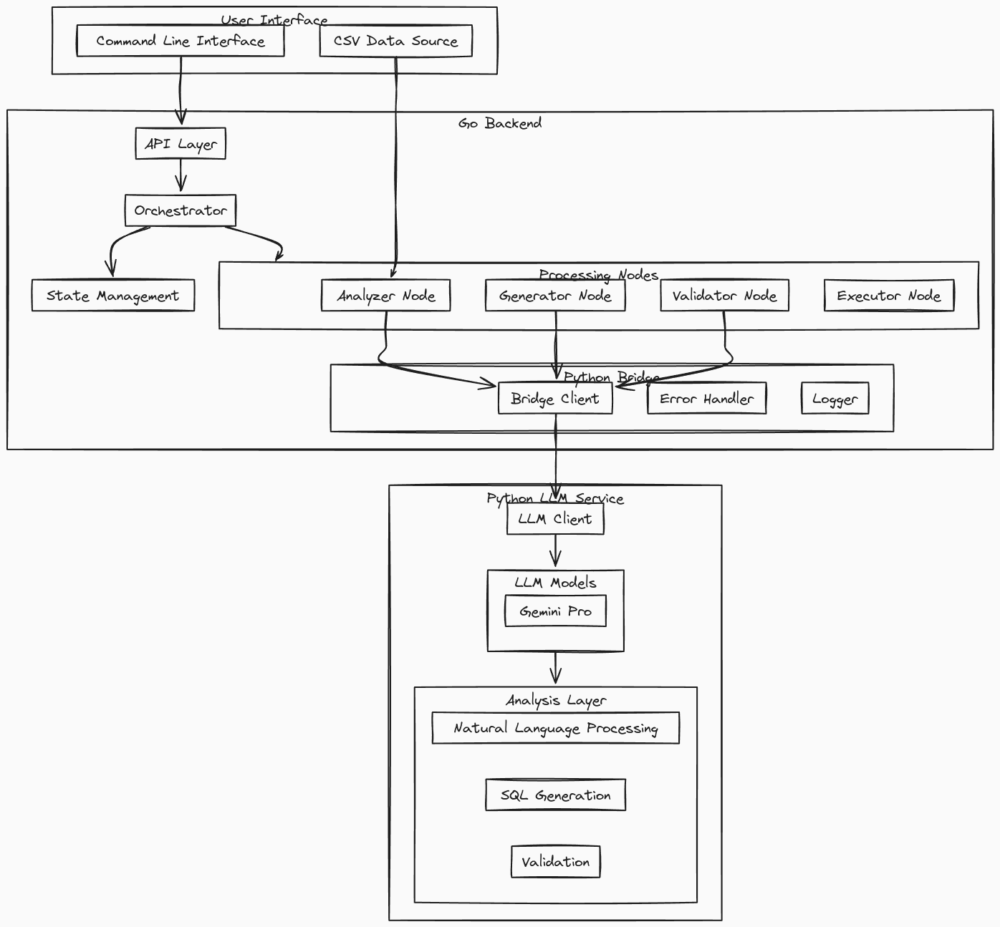
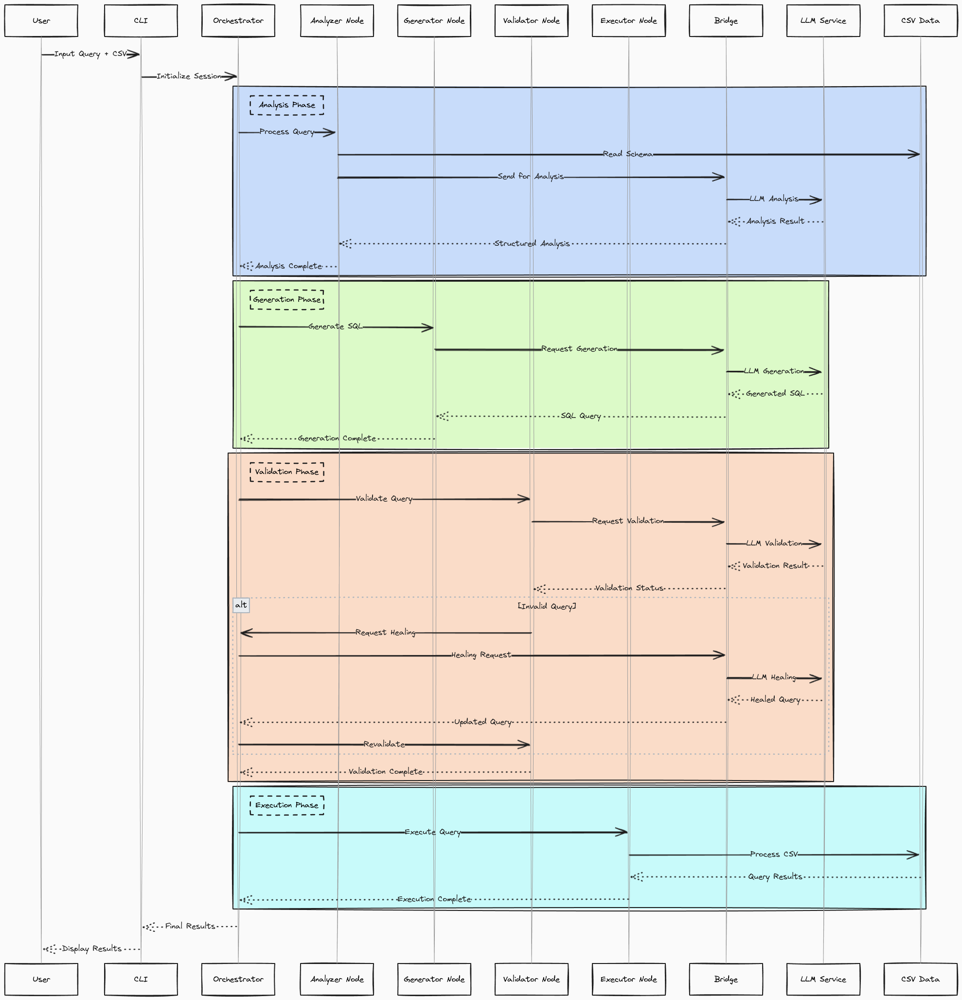
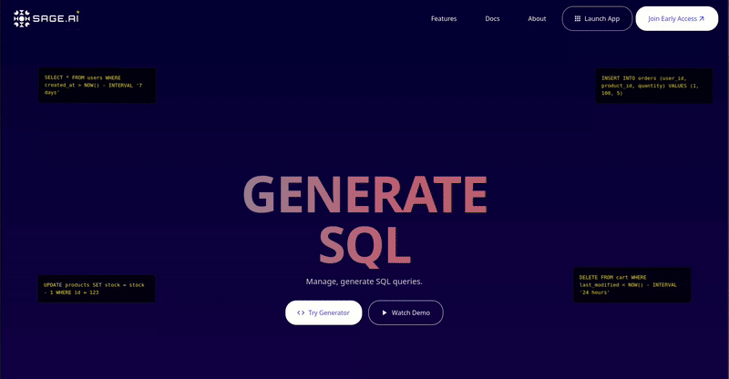
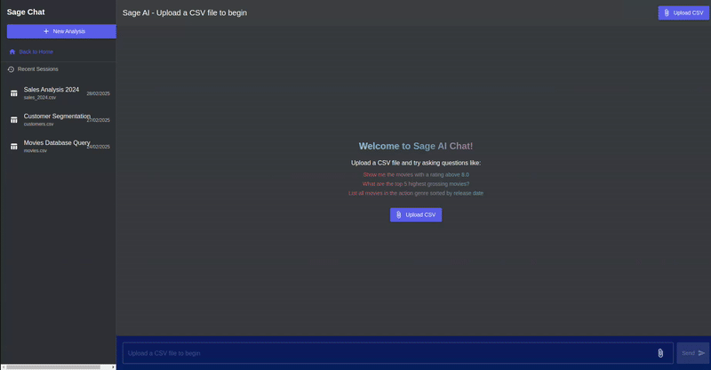
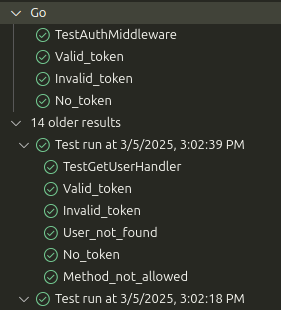
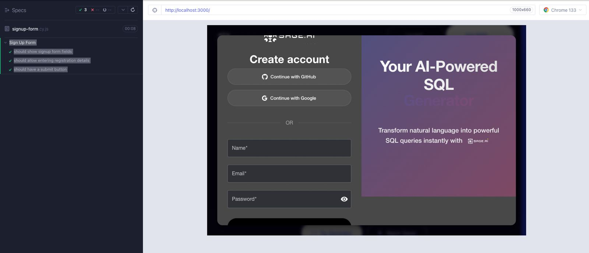
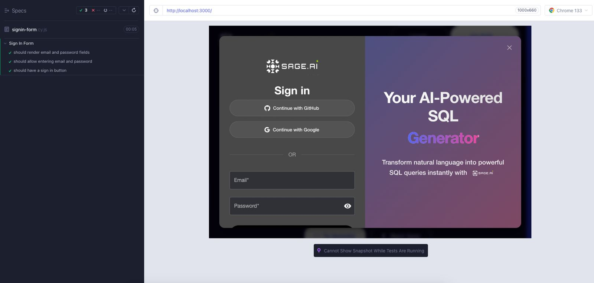

# Sage.AI - Natural Language SQL Query Assistant

## Description
Sage.AI is an intelligent system that transforms natural language into SQL queries using LLMs and few-shot learning. It executes queries and presents results through an interactive chatbot interface, maintaining context for follow-ups while adapting to different database schemas. We eventually aim to make it data-agnostic so that Sage.ai is a one stop solution for all kinds of use-cases.

<div style="background-color: #404EED; padding: 20px; text-align: center; margin: 20px 0;">
  
</div>

Find our demo videos for each Sprint here! [Sprint Demo videos](https://uflorida-my.sharepoint.com/personal/yashkishore_ufl_edu/_layouts/15/onedrive.aspx?id=%2Fpersonal%2Fyashkishore%5Fufl%5Fedu%2FDocuments%2FSoftware%20Engineering&ga=1)
 
## Problem Statement
Data analysts and business users often struggle with writing complex SQL queries. While they understand what information they need, translating natural language to SQL is challenging and time-consuming. Existing solutions either lack accuracy, require extensive training, or are limited to specific database schemas. Sage.AI addresses these challenges by providing an intuitive, adaptive interface that handles query generation, execution, and result presentation.

## Team Members
- **Aakash Singh** - Backend Dev
- **Bommidi Nitin Reddy** - Backend Dev
- **Sudiksha Rajavaram** - Frontend Dev
- **Yash Kishore** - Frontend Dev

## Architecture Overview

```
┌─────────────────┐         ┌─────────────────────────────────────────┐         ┌─────────────────┐
│                 │         │                                         │         │                 │
│  React Frontend │◄────────┤           Go Backend Server             │◄────────┤  Python LLM     │
│  (Components)   │         │                                         │         │  Microservice   │
│                 │         │                                         │         │                 │
└─────────────────┘         └─────────────────────────────────────────┘         └─────────────────┘
    │                                       │                                         │
    │                                       │                                         │
    ▼                                       ▼                                         ▼
┌─────────────────┐         ┌─────────────────────────────────────────┐         ┌─────────────────┐
│  UI Components  │         │  Request Handlers & API Controllers      │         │ LLM Integration │
│  Auth Flow      │─────────┤  Authentication Services                 │         │ Text Analysis   │
│  Chat Interface │         │  Orchestrator & Node Management          │─────────┤ SQL Generation  │
│  File Upload    │         │  Database Connections                    │         │ Query Validation│
│  Visualization  │         │  Session & State Management              │         │ Healing Logic   │
└─────────────────┘         └─────────────────────────────────────────┘         └─────────────────┘
                                                │
                                                │
                                                ▼
                                    ┌───────────────────────┐
                                    │    Database Layer     │
                                    │  (PostgreSQL/SQLite)  │
                                    └───────────────────────┘
```


- **Three-Tier Architecture:** Sage.AI uses a three-tier system with React frontend, Go backend, and Python LLM service working together seamlessly.
- **Go Backend as Orchestrator:** The Go server functions as the central orchestrator, handling HTTP requests, authentication flows, and coordinating the entire query processing pipeline.
- **Python for AI Processing:** The Python microservice specializes in LLM interactions, performing natural language analysis, SQL generation, and query validation/healing.
- **Request Flow:** When a user submits a natural language query, the React frontend sends it to the Go backend, which routes appropriate processing tasks to the Python service.
- **Stateful Processing:** The Go orchestrator maintains state throughout the query lifecycle, tracking progress and managing retries if needed.
- **Communication Protocol:** The Go-Python bridge uses HTTP/REST for inter-service communication, with JSON-formatted requests and responses.
- **Error Handling:** The system implements sophisticated error handling across all tiers, with the Go orchestrator capable of requesting query healing from the Python service.
- **Result Formatting:** After processing, results flow back through Go for formatting before delivery to the React frontend.
- **Authentication Integration:** User authentication (via OAuth or email/password) is handled by Go, with tokens passed to the frontend for session management.
- **Scalability:** This architecture allows each component to scale independently while maintaining clear separation of concerns.

### LLM Orchestrator Architecture


The AI system consists of three main layers:

### 1. Knowledge Layer
- Few Shot Examples Management
- Vector Store for Similarity Search
- Base Knowledge Base for Query Patterns
- Dataset-Specific Knowledge Base

### 2. Orchestration Layer
- Main Orchestrator for Query Processing
- Node Factory for Component Creation
- Processing Nodes:
  - Analyzer (Natural Language Understanding)
  - Generator (SQL Creation)
  - Validator (Query Safety)
  - Executor (Query Execution)

### 3. Data Layer
- Database Connection Management
- Schema Handling
- Query Execution Engine

## Tech Stack
- Backend: Golang, Python, FastAPI
- LLM: OpenAI, Google Gemini, Vector Embeddings
- Database: PostgreSQL/SQLite
- Frontend: React, Material UI, Tailwind CSS

## How to Run the Project

### Prerequisites
- Go 1.18+
- Python 3.8+
- Node.js 14+
- npm or yarn

### Running the Backend
1. **Install dependencies (first time only):**
   ```bash
   cd ~/Development/sage-ai/Sage-ai/v2/backend/python
   pip install -r requirements.txt
   ```
2. **Start the Python LLM Service:**
   ```bash
   cd ~/Development/sage-ai/Sage-ai/v2/backend/python
   python -m uvicorn app.main:app --reload
   ```

3. **Start the Go Backend Server:**
   ```bash
   cd ~/Development/sage-ai/Sage-ai/v2/backend/go
   go run cmd/server/main.go
   ```

### Running the Frontend
1. **Install dependencies (first time only):**
   ```bash
   cd ~/Development/sage-ai/Sage-ai/v2/frontend
   npm install
   ```

2. **Start the development server:**
   ```bash
   npm start
   ```

### Accessing the Application
- Frontend: `http://localhost:3000`
- Go Backend API: `http://localhost:8080`
- Python LLM Service: `http://localhost:8000`

# 🚀 Sprint 1: Core Implementation

## 🌟 Overview
Sprint 1 laid the foundation through two parallel tracks: a sophisticated backend combining Go's robustness with Python's AI capabilities, and a modern, responsive React frontend providing an intuitive user interface. The focus was on creating the core components of the system that would later be integrated.

Please find our Sprint 1 demo videos here [Sprint 1 Demo Videos](https://uflorida-my.sharepoint.com/:f:/g/personal/yashkishore_ufl_edu/ElJmHJX7_MZOnXux4XqXZMwBFZym0c6I1-c2zmHlxkS77Q?e=b3KxO3)

> Note: v1 was our initial version of Sage-ai with its complete backend in Python and FastAPI. After discussions with Prof. Alin Dobra, we pivoted towards v2 with Golang + Python(for LLM calling) for our backend.

## Frontend Implementation (Sprint 1)


### Key Features & Achievements
- Modern web application with responsive UI
- Material UI integration for theme consistency
- Interactive sections:
  - Hero section with floating SQL snippets
  - Features grid showing query capabilities
  - Demo section with preview functionality
  - Use cases highlighting benefits for developers & analysts

## Backend Implementation (Sprint 1)

### High-Level Architecture


Our backend system follows a hybrid architecture where core business logic resides in Go while leveraging Python's machine learning capabilities through a bridge pattern.

### Processing Pipeline


The system processes queries through a sophisticated pipeline:
1. 🔍 **Query Analysis** - Natural language understanding & schema context integration
2. ⚙️ **Query Generation** - SQL structure creation with schema validation
3. ✅ **Query Validation** - Structural validation & security verification
4. 🎬 **Query Execution** - Data retrieval & result formatting

### Key Backend Achievements (Sprint 1)
- Successfully created Go-Python bridge
- Implemented robust error handling
- Developed core query processing pipeline
- Created automatic schema detection
- Implemented query validation and healing

# 🚀 Sprint 2: Full Stack Integration

## 🌟 Overview
Sprint 2 focused on integrating the frontend and backend components, creating a seamless user experience for natural language to SQL conversion. The major achievements were a fully functional authentication system with multiple sign-in methods and connecting the React frontend to our Go+Python backend orchestration pipeline.

Please find our Sprint 2 demo videos here [Sprint 2 Demo Videos](https://uflorida-my.sharepoint.com/personal/yashkishore_ufl_edu/_layouts/15/onedrive.aspx?id=%2Fpersonal%2Fyashkishore%5Fufl%5Fedu%2FDocuments%2FSoftware%20Engineering%2FSprint2&ga=1)

### Auth System


### Chat Interface with Pipeline Integration


## Key Achievements (Sprint 2)

- **Comprehensive Authentication System**
  - Email/password authentication with secure hashing
  - OAuth integration with GitHub and Google
  - JWT token-based session management
  - Security features including CORS protection and rate limiting

- **Interactive Chat Interface**
  - Persistent chat history and message threading
  - Real-time response rendering
  - File upload with drag-and-drop
  - CSV schema detection and visualization

- **Full Pipeline Integration**
  - End-to-end query processing
  - Real-time validation and error handling
  - Context-aware query generation
  - Formatted result presentation

## Testing Infrastructure

### Backend Testing
- Comprehensive unit tests for authentication handlers and services
- Integration tests for API endpoints and database operations
- Error handling and edge case coverage



### Frontend Testing
- Cypress end-to-end tests for authentication flows and chat functionality
- Jest unit tests for components, context, and hooks




## 🔍 API Documentation

### Authentication Endpoints
- **POST /api/auth/signup** - Creates a new user account
- **POST /api/auth/signin** - Authenticates an existing user
- **POST /api/auth/oauth/github** and **POST /api/auth/oauth/google** - Handles OAuth authentication

### Query Endpoints
- **POST /api/upload** - Uploads a CSV file for querying
- **POST /api/query** - Processes a natural language query

## 🚀 Next Steps

For Sprint 3, we are planning:
1. Advanced data visualization with charts and export functionality
2. Multi-database support (PostgreSQL, MySQL, SQL Server)
3. Context adding in Vector store in the form of DDL Schemas, Business logic, Prior SQL Queries
4. Knowledge base of correct Query-Question pair for context
5. Chat history and New Session Creation

## 📋 License
This project is licensed under the MIT License - see the [LICENSE.md](LICENSE.md) file for details.