<!-- # Sage.AI - Natural Language SQL Query Assistant

## Description
Sage.AI is an intelligent system that transforms natural language into SQL queries using LLMs and few-shot learning. It executes queries and presents results through an interactive chatbot interface, maintaining context for follow-ups while adapting to different database schemas. We eventually aim to make it data-agnostic so that Sage.ai is a one stop solution for all kinds of use-cases.

<div style="background-color: #404EED; padding: 20px; text-align: center; margin: 20px 0;">
  
</div>

Find our demo videos for each Sprint here! [Sprint Demo videos](https://uflorida-my.sharepoint.com/personal/yashkishore_ufl_edu/_layouts/15/onedrive.aspx?id=%2Fpersonal%2Fyashkishore%5Fufl%5Fedu%2FDocuments%2FSoftware%20Engineering&ga=1)
 
## Problem Statement
Data analysts and business users often struggle with writing complex SQL queries. While they understand what information they need, translating natural language to SQL is challenging and time-consuming. Existing solutions either lack accuracy, require extensive training, or are limited to specific database schemas. Sage.AI addresses these challenges by providing an intuitive, adaptive interface that handles query generation, execution, and result presentation.

## Team Members
- **Aakash Singh** - Lead and Architect, ML and Backend Dev, Frontend Dev
- **Bommidi Nitin Reddy** - Backend Dev
- **Sudiksha Rajavaram** - Frontend Dev
- **Yash Kishore** - Frontend Dev

## Architecture Overview

```
┌─────────────────┐         ┌─────────────────────────────────────────┐         ┌─────────────────┐
│                 │         │                                         │         │                 │
│  React Frontend │◄────────┤           Go Backend Server             │◄────────┤  Python LLM     │
│  (Components)   │         │                                         │         │  Microservice   │
│                 │         │                                         │         │                 │
└─────────────────┘         └─────────────────────────────────────────┘         └─────────────────┘
    │                                       │                                         │
    │                                       │                                         │
    ▼                                       ▼                                         ▼
┌─────────────────┐         ┌─────────────────────────────────────────┐         ┌─────────────────┐
│  UI Components  │         │  Request Handlers & API Controllers      │         │ LLM Integration │
│  Auth Flow      │─────────┤  Authentication Services                 │         │ Text Analysis   │
│  Chat Interface │         │  Orchestrator & Node Management          │─────────┤ SQL Generation  │
│  File Upload    │         │  Database Connections                    │         │ Query Validation│
│  Visualization  │         │  Session & State Management              │         │ Healing Logic   │
│  Knowledge UI   │         │  Knowledge Base System                   │         │                 │
└─────────────────┘         └─────────────────────────────────────────┘         └─────────────────┘
                                                │
                                                │
                                                ▼
                             ┌────────────────────────────────┐
                             │         Database Layer         │
                             │    (PostgreSQL/SQLite &        │
                             │     Vector Knowledge Store)    │
                             └────────────────────────────────┘
```


- **Three-Tier Architecture:** Sage.AI uses a three-tier system with React frontend, Go backend, and Python LLM service working together seamlessly.
- **Go Backend as Orchestrator:** The Go server functions as the central orchestrator, handling HTTP requests, authentication flows, and coordinating the entire query processing pipeline.
- **Python for AI Processing:** The Python microservice specializes in LLM interactions, performing natural language analysis, SQL generation, and query validation/healing.
- **Knowledge Base System:** A vector database that stores and retrieves contextually relevant database schemas, documentation, and example queries to enhance SQL generation accuracy.
- **Request Flow:** When a user submits a natural language query, the React frontend sends it to the Go backend, which routes appropriate processing tasks to the Python service.
- **Stateful Processing:** The Go orchestrator maintains state throughout the query lifecycle, tracking progress and managing retries if needed.
- **Communication Protocol:** The Go-Python bridge uses HTTP/REST for inter-service communication, with JSON-formatted requests and responses.
- **Error Handling:** The system implements sophisticated error handling across all tiers, with the Go orchestrator capable of requesting query healing from the Python service.
- **Result Formatting:** After processing, results flow back through Go for formatting before delivery to the React frontend.
- **Authentication Integration:** User authentication (via OAuth or email/password) is handled by Go, with tokens passed to the frontend for session management.
- **Scalability:** This architecture allows each component to scale independently while maintaining clear separation of concerns.

### LLM Orchestrator Architecture


The AI system consists of three main layers:

### 1. Knowledge Layer
- Few Shot Examples Management
- Vector Store for Similarity Search
- Base Knowledge Base for Query Patterns
- Dataset-Specific Knowledge Base
- DDL Schemas & Documentation Storage
- Question-SQL Pairs Repository

### 2. Orchestration Layer
- Main Orchestrator for Query Processing
- Node Factory for Component Creation
- Processing Nodes:
  - Analyzer (Natural Language Understanding)
  - Generator (SQL Creation with Knowledge Context)
  - Validator (Query Safety)
  - Executor (Query Execution)

### 3. Data Layer
- Database Connection Management
- Schema Handling
- Query Execution Engine
- Chat Session Persistence

## Tech Stack
- Backend: Golang, Python, FastAPI
- LLM: OpenAI, Google Gemini, Vector Embeddings
- Database: PostgreSQL/SQLite
- Frontend: React, Material UI, Tailwind CSS

## How to Run the Project

### Prerequisites
- Go 1.18+
- Python 3.8+
- Node.js 14+
- npm or yarn

### Running the Backend
1. **Install dependencies (first time only):**
   ```bash
   cd ~/Development/sage-ai/Sage-ai/v2/backend/python
   pip install -r requirements.txt
   ```
2. **Start the Python LLM Service:**
   ```bash
   cd ~/Development/sage-ai/Sage-ai/v2/backend/python
   python -m uvicorn app.main:app --reload
   ```

3. **Start the Go Backend Server:**
   ```bash
   cd ~/Development/sage-ai/Sage-ai/v2/backend/go
   go run cmd/server/main.go
   ```

### Running the Frontend
1. **Install dependencies (first time only):**
   ```bash
   cd ~/Development/sage-ai/Sage-ai/v2/frontend
   npm install
   ```

2. **Start the development server:**
   ```bash
   npm start
   ```

### Accessing the Application
- Frontend: `http://localhost:3000`
- Go Backend API: `http://localhost:8080`
- Python LLM Service: `http://localhost:8000`

# 🚀 Sprint 1: Core Implementation

## 🌟 Overview
Sprint 1 laid the foundation through two parallel tracks: a sophisticated backend combining Go's robustness with Python's AI capabilities, and a modern, responsive React frontend providing an intuitive user interface. The focus was on creating the core components of the system that would later be integrated.

Please find our Sprint 1 demo videos here [Sprint 1 Demo Videos](https://uflorida-my.sharepoint.com/:f:/g/personal/yashkishore_ufl_edu/ElJmHJX7_MZOnXux4XqXZMwBFZym0c6I1-c2zmHlxkS77Q?e=b3KxO3)

> Note: v1 was our initial version of Sage-ai with its complete backend in Python and FastAPI. After discussions with Prof. Alin Dobra, we pivoted towards v2 with Golang + Python(for LLM calling) for our backend.

## Frontend Implementation (Sprint 1)


### Key Features & Achievements
- Modern web application with responsive UI
- Material UI integration for theme consistency
- Interactive sections:
  - Hero section with floating SQL snippets
  - Features grid showing query capabilities
  - Demo section with preview functionality
  - Use cases highlighting benefits for developers & analysts

## Backend Implementation (Sprint 1)

### High-Level Architecture


Our backend system follows a hybrid architecture where core business logic resides in Go while leveraging Python's machine learning capabilities through a bridge pattern.

### Processing Pipeline


The system processes queries through a sophisticated pipeline:
1. 🔍 **Query Analysis** - Natural language understanding & schema context integration
2. ⚙️ **Query Generation** - SQL structure creation with schema validation
3. ✅ **Query Validation** - Structural validation & security verification
4. 🎬 **Query Execution** - Data retrieval & result formatting

### Key Backend Achievements (Sprint 1)
- Successfully created Go-Python bridge
- Implemented robust error handling
- Developed core query processing pipeline
- Created automatic schema detection
- Implemented query validation and healing

# 🚀 Sprint 2: Full Stack Integration

## 🌟 Overview
Sprint 2 focused on integrating the frontend and backend components, creating a seamless user experience for natural language to SQL conversion. The major achievements were a fully functional authentication system with multiple sign-in methods and connecting the React frontend to our Go+Python backend orchestration pipeline.

Please find our Sprint 2 demo videos here [Sprint 2 Demo Videos](https://uflorida-my.sharepoint.com/personal/yashkishore_ufl_edu/_layouts/15/onedrive.aspx?id=%2Fpersonal%2Fyashkishore%5Fufl%5Fedu%2FDocuments%2FSoftware%20Engineering%2FSprint2&ga=1)

### Auth System


### Chat Interface with Pipeline Integration


## Key Achievements (Sprint 2)

- **Comprehensive Authentication System**
  - Email/password authentication with secure hashing
  - OAuth integration with GitHub and Google
  - JWT token-based session management
  - Security features including CORS protection and rate limiting

- **Interactive Chat Interface**
  - Persistent chat history and message threading
  - Real-time response rendering
  - File upload with drag-and-drop
  - CSV schema detection and visualization

- **Full Pipeline Integration**
  - End-to-end query processing
  - Real-time validation and error handling
  - Context-aware query generation
  - Formatted result presentation

## Testing Infrastructure (Sprint 2)

### Backend Testing
- Comprehensive unit tests for authentication handlers and services
- Integration tests for API endpoints and database operations
- Error handling and edge case coverage


### Frontend Testing
- Cypress end-to-end tests for authentication flows and chat functionality
- Jest unit tests for components, context, and hooks


# 🚀 Sprint 3: Knowledge Base and Chat Session Management

## 🌟 Overview

Sprint 3 transformed Sage.AI into a more intelligent and context-aware SQL assistant through two major advancements: a sophisticated Knowledge Base system and enhanced Chat Session Management. These improvements allow for more accurate SQL query generation by leveraging contextual information and enable seamless conversation continuity across multiple interactions.

Please find our Sprint 3 demo videos here [Sprint 3 Demo Videos](https://uflorida-my.sharepoint.com/personal/yashkishore_ufl_edu/_layouts/15/onedrive.aspx?id=%2Fpersonal%2Fyashkishore%5Fufl%5Fedu%2FDocuments%2FSoftware%20Engineering%2FSprint3&ga=1)

### Knowledge Base System
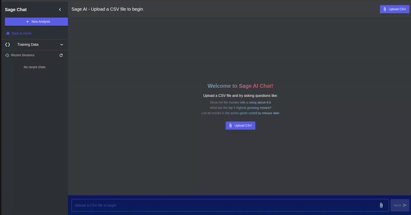

### Enhanced Chat Sessions


## Key Achievements (Sprint 3)

- **Knowledge Base System**
  - Vector database for semantic similarity search across three types of training data (DDL schemas, documentation, question-SQL pairs)
  - Knowledge context integration with query generation for more accurate SQL conversion
  
- **Advanced Chat Management**
  - Persistent chat sessions with JSON-based storage
  - Chat-specific training data associations
  - Automatic chat state recovery and continuation
  - Enhanced UI for chat creation, selection, history navigation, and deletion

- **Enhanced Query Processing**
  - Context-aware query generation with knowledge base integration
  - Improved error handling and recovery mechanisms
  - More natural language responses with contextual awareness

- **Comprehensive API Development**
  - Complete set of endpoints for knowledge management
  - Chat session persistence and management endpoints
  - Training data association endpoints

## Testing Infrastructure (Sprint 3)

We expanded our testing infrastructure to cover the new Knowledge Base and Chat Session Management features:

### Backend Testing Organization
- Strategically organized tests by component (orchestrator, API, knowledge)
- Created a comprehensive Makefile for simplified test execution
- Implemented custom mocking strategy for isolated component testing

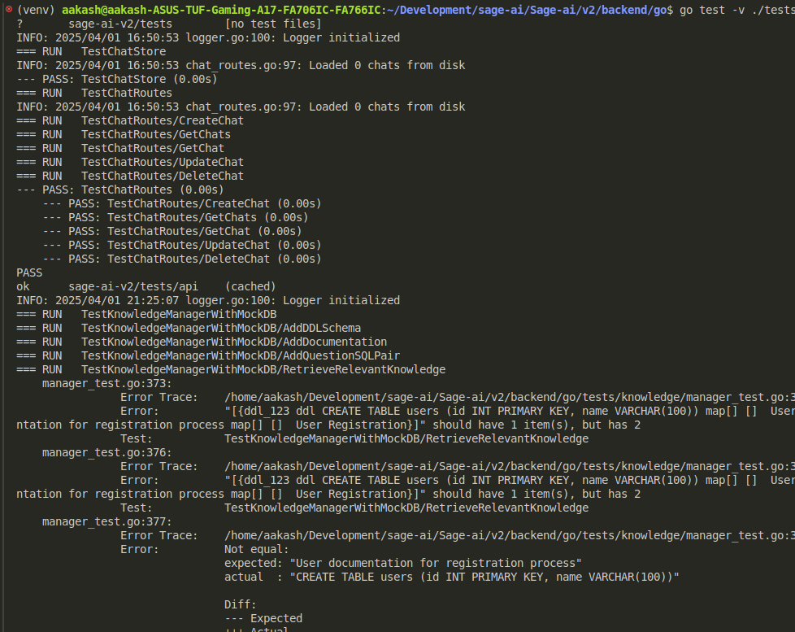
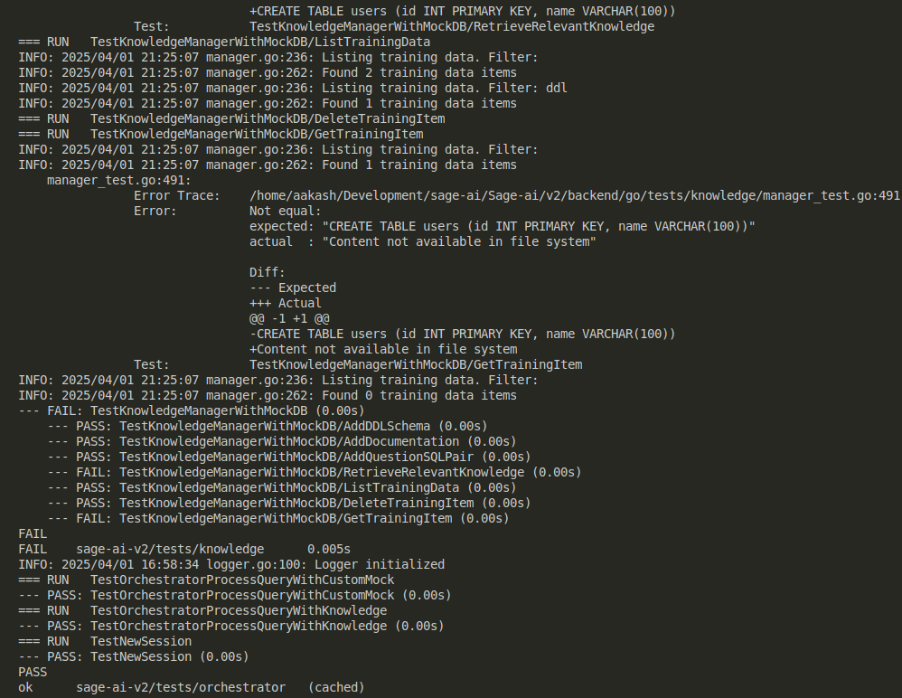

### Knowledge Base Component Tests
- 36 unit tests for vector database operations, knowledge retrieval, and item management
- 90% code coverage for Knowledge Base components
- Key test areas: vector database creation, training item CRUD operations, similarity search

### Chat Session Tests
- 24 unit tests for chat creation, persistence, state management, and history
- 85% code coverage for Chat Management components
- Key test areas: chat store operations, chat-training data associations, state synchronization

### Integration Tests
- 12 end-to-end tests for the complete query processing pipeline with knowledge context
- 75% coverage of integration points between components
- Key test areas: knowledge integration with query generation, chat session recovery

## Technical Implementation

### Knowledge Base System

The Knowledge Base system consists of three key components:

1. **Vector Database**
   - In-memory vector store with disk persistence
   - Simple vector embeddings for semantic similarity
   - Efficient similarity search for knowledge retrieval

2. **Knowledge Manager**
   - Three types of knowledge items:
     - DDL Schemas (database structure information)
     - Documentation (business logic and domain knowledge)
     - Question-SQL Pairs (example queries with natural language questions)
   - CRUD operations for knowledge items
   - Context retrieval for query enhancement

3. **Knowledge Integration**
   - Seamless integration with the query processing pipeline
   - Optional knowledge base usage toggle for users
   - Knowledge context tracking in chat responses

### Chat Session Management

The enhanced chat system includes:

1. **Chat Store**
   - JSON-based persistence for chat sessions
   - Efficient CRUD operations for chat data
   - Automatic session recovery

2. **Chat-Training Data Association**
   - Ability to link training data items to specific chats
   - Prioritized knowledge context based on chat associations
   - Chat-specific knowledge management

3. **UI Enhancements**
   - New chat creation and selection
   - Chat history navigation
   - Chat deletion and management

## 🔍 API Documentation

### Authentication Endpoints (Sprint 2)
- **POST /api/auth/signup** - Creates a new user account
- **POST /api/auth/signin** - Authenticates an existing user
- **POST /api/auth/oauth/github** and **POST /api/auth/oauth/google** - Handles OAuth authentication

### Query Endpoints (Sprint 2)
- **POST /api/upload** - Uploads a CSV file for querying
- **POST /api/query** - Processes a natural language query

### Knowledge Base Endpoints (Sprint 3)
- **GET /api/training/list** - Lists all training data items
- **POST /api/training/upload** - Uploads a file as training data
- **POST /api/training/add** - Adds training data manually
- **GET /api/training/view/{id}** - Views a specific training data item
- **DELETE /api/training/delete/{id}** - Deletes a training data item

### Chat Session Endpoints (Sprint 3)
- **GET /api/chats** - Lists all chat sessions
- **POST /api/chats** - Creates a new chat session
- **GET /api/chats/{id}** - Gets a specific chat by ID
- **PUT /api/chats/{id}** - Updates a chat session
- **DELETE /api/chats/{id}** - Deletes a chat session
- **GET /api/chats/{id}/training** - Gets training data associated with a chat
- **POST /api/chats/{id}/training** - Updates training data associated with a chat

## 🚀 Next Steps

For future sprints, we plan to:

1. **Enhanced Visualization**
   - Interactive charts and graphs for query results
   - Customizable visualization options
   - Visual query builder integration

2. **Advanced Knowledge Management**
   - Automated knowledge extraction from databases
   - Knowledge graph visualization
   - Collaborative knowledge base editing

3. **Multi-Database Support**
   - Expanded database connector system
   - Cross-database query capabilities
   - Schema inference and validation

4. **Enterprise Features**
   - Team collaboration on knowledge bases
   - Access control and permissions
   - Audit logging and compliance

## 📋 License
This project is licensed under the MIT License - see the [LICENSE.md](LICENSE.md) file for details. 

# Sage.AI - Natural Language SQL Query Assistant

## Description
Sage.AI is an intelligent system that transforms natural language into SQL queries using LLMs and few-shot learning. It executes queries and presents results through an interactive chatbot interface, maintaining context for follow-ups while adapting to different database schemas. We eventually aim to make it data-agnostic so that Sage.ai is a one stop solution for all kinds of use-cases.

<div style="background-color: #404EED; padding: 20px; text-align: center; margin: 20px 0;">
  
</div>

Find our demo videos for each Sprint here! [Sprint Demo videos](https://uflorida-my.sharepoint.com/personal/yashkishore_ufl_edu/_layouts/15/onedrive.aspx?id=%2Fpersonal%2Fyashkishore%5Fufl%5Fedu%2FDocuments%2FSoftware%20Engineering&ga=1)
 
## Problem Statement
Data analysts and business users often struggle with writing complex SQL queries. While they understand what information they need, translating natural language to SQL is challenging and time-consuming. Existing solutions either lack accuracy, require extensive training, or are limited to specific database schemas. Sage.AI addresses these challenges by providing an intuitive, adaptive interface that handles query generation, execution, and result presentation.

## Team Members
- **Aakash Singh** - Backend Dev
- **Bommidi Nitin Reddy** - Backend Dev
- **Sudiksha Rajavaram** - Frontend Dev
- **Yash Kishore** - Frontend Dev

## Architecture Overview

```
┌─────────────────┐         ┌─────────────────────────────────────────┐         ┌─────────────────┐
│                 │         │                                         │         │                 │
│  React Frontend │◄────────┤           Go Backend Server             │◄────────┤  Python LLM     │
│  (Components)   │         │                                         │         │  Microservice   │
│                 │         │                                         │         │                 │
└─────────────────┘         └─────────────────────────────────────────┘         └─────────────────┘
    │                                       │                                         │
    │                                       │                                         │
    ▼                                       ▼                                         ▼
┌─────────────────┐         ┌─────────────────────────────────────────┐         ┌─────────────────┐
│  UI Components  │         │  Request Handlers & API Controllers      │         │ LLM Integration │
│  Auth Flow      │─────────┤  Authentication Services                 │         │ Text Analysis   │
│  Chat Interface │         │  Orchestrator & Node Management          │─────────┤ SQL Generation  │
│  File Upload    │         │  Database Connections                    │         │ Query Validation│
│  Visualization  │         │  Session & State Management              │         │ Healing Logic   │
│  Knowledge UI   │         │  Knowledge Base System                   │         │                 │
└─────────────────┘         └─────────────────────────────────────────┘         └─────────────────┘
                                                │
                                                │
                                                ▼
                             ┌────────────────────────────────┐
                             │         Database Layer         │
                             │    (PostgreSQL/SQLite &        │
                             │     Vector Knowledge Store)    │
                             └────────────────────────────────┘
```


- **Three-Tier Architecture:** Sage.AI uses a three-tier system with React frontend, Go backend, and Python LLM service working together seamlessly.
- **Go Backend as Orchestrator:** The Go server functions as the central orchestrator, handling HTTP requests, authentication flows, and coordinating the entire query processing pipeline.
- **Python for AI Processing:** The Python microservice specializes in LLM interactions, performing natural language analysis, SQL generation, and query validation/healing.
- **Knowledge Base System:** A vector database that stores and retrieves contextually relevant database schemas, documentation, and example queries to enhance SQL generation accuracy.
- **Request Flow:** When a user submits a natural language query, the React frontend sends it to the Go backend, which routes appropriate processing tasks to the Python service.
- **Stateful Processing:** The Go orchestrator maintains state throughout the query lifecycle, tracking progress and managing retries if needed.
- **Communication Protocol:** The Go-Python bridge uses HTTP/REST for inter-service communication, with JSON-formatted requests and responses.
- **Error Handling:** The system implements sophisticated error handling across all tiers, with the Go orchestrator capable of requesting query healing from the Python service.
- **Result Formatting:** After processing, results flow back through Go for formatting before delivery to the React frontend.
- **Authentication Integration:** User authentication (via OAuth or email/password) is handled by Go, with tokens passed to the frontend for session management.
- **Scalability:** This architecture allows each component to scale independently while maintaining clear separation of concerns.

### LLM Orchestrator Architecture


The AI system consists of three main layers:

### 1. Knowledge Layer
- Few Shot Examples Management
- Vector Store for Similarity Search
- Base Knowledge Base for Query Patterns
- Dataset-Specific Knowledge Base
- DDL Schemas & Documentation Storage
- Question-SQL Pairs Repository

### 2. Orchestration Layer
- Main Orchestrator for Query Processing
- Node Factory for Component Creation
- Processing Nodes:
  - Analyzer (Natural Language Understanding)
  - Generator (SQL Creation with Knowledge Context)
  - Validator (Query Safety)
  - Executor (Query Execution)

### 3. Data Layer
- Database Connection Management
- Schema Handling
- Query Execution Engine
- Chat Session Persistence

## Tech Stack
- Backend: Golang, Python, FastAPI
- LLM: OpenAI, Google Gemini, Vector Embeddings
- Database: PostgreSQL/SQLite
- Frontend: React, Material UI, Tailwind CSS

## How to Run the Project

### Prerequisites
- Go 1.18+
- Python 3.8+
- Node.js 14+
- npm or yarn

### Running the Backend
1. **Install dependencies (first time only):**
   ```bash
   cd ~/Development/sage-ai/Sage-ai/v2/backend/python
   pip install -r requirements.txt
   ```
2. **Start the Python LLM Service:**
   ```bash
   cd ~/Development/sage-ai/Sage-ai/v2/backend/python
   python -m uvicorn app.main:app --reload
   ```

3. **Start the Go Backend Server:**
   ```bash
   cd ~/Development/sage-ai/Sage-ai/v2/backend/go
   go run cmd/server/main.go
   ```

### Running the Frontend
1. **Install dependencies (first time only):**
   ```bash
   cd ~/Development/sage-ai/Sage-ai/v2/frontend
   npm install
   ```

2. **Start the development server:**
   ```bash
   npm start
   ```

### Accessing the Application
- Frontend: `http://localhost:3000`
- Go Backend API: `http://localhost:8080`
- Python LLM Service: `http://localhost:8000`

# 🚀 Sprint 1: Core Implementation

## 🌟 Overview
Sprint 1 laid the foundation through two parallel tracks: a sophisticated backend combining Go's robustness with Python's AI capabilities, and a modern, responsive React frontend providing an intuitive user interface. The focus was on creating the core components of the system that would later be integrated.

Please find our Sprint 1 demo videos here [Sprint 1 Demo Videos](https://uflorida-my.sharepoint.com/:f:/g/personal/yashkishore_ufl_edu/ElJmHJX7_MZOnXux4XqXZMwBFZym0c6I1-c2zmHlxkS77Q?e=b3KxO3)

> Note: v1 was our initial version of Sage-ai with its complete backend in Python and FastAPI. After discussions with Prof. Alin Dobra, we pivoted towards v2 with Golang + Python(for LLM calling) for our backend.

## Frontend Implementation (Sprint 1)


### Key Features & Achievements
- Modern web application with responsive UI
- Material UI integration for theme consistency
- Interactive sections:
  - Hero section with floating SQL snippets
  - Features grid showing query capabilities
  - Demo section with preview functionality
  - Use cases highlighting benefits for developers & analysts

## Backend Implementation (Sprint 1)

### High-Level Architecture


Our backend system follows a hybrid architecture where core business logic resides in Go while leveraging Python's machine learning capabilities through a bridge pattern.

### Processing Pipeline


The system processes queries through a sophisticated pipeline:
1. 🔍 **Query Analysis** - Natural language understanding & schema context integration
2. ⚙️ **Query Generation** - SQL structure creation with schema validation
3. ✅ **Query Validation** - Structural validation & security verification
4. 🎬 **Query Execution** - Data retrieval & result formatting

### Key Backend Achievements (Sprint 1)
- Successfully created Go-Python bridge
- Implemented robust error handling
- Developed core query processing pipeline
- Created automatic schema detection
- Implemented query validation and healing

# 🚀 Sprint 2: Full Stack Integration

## 🌟 Overview
Sprint 2 focused on integrating the frontend and backend components, creating a seamless user experience for natural language to SQL conversion. The major achievements were a fully functional authentication system with multiple sign-in methods and connecting the React frontend to our Go+Python backend orchestration pipeline.

Please find our Sprint 2 demo videos here [Sprint 2 Demo Videos](https://uflorida-my.sharepoint.com/personal/yashkishore_ufl_edu/_layouts/15/onedrive.aspx?id=%2Fpersonal%2Fyashkishore%5Fufl%5Fedu%2FDocuments%2FSoftware%20Engineering%2FSprint2&ga=1)

### Auth System


### Chat Interface with Pipeline Integration


## Key Achievements (Sprint 2)

- **Comprehensive Authentication System**
  - Email/password authentication with secure hashing
  - OAuth integration with GitHub and Google
  - JWT token-based session management
  - Security features including CORS protection and rate limiting

- **Interactive Chat Interface**
  - Persistent chat history and message threading
  - Real-time response rendering
  - File upload with drag-and-drop
  - CSV schema detection and visualization

- **Full Pipeline Integration**
  - End-to-end query processing
  - Real-time validation and error handling
  - Context-aware query generation
  - Formatted result presentation

## Testing Infrastructure (Sprint 2)

### Backend Testing
- Comprehensive unit tests for authentication handlers and services
- Integration tests for API endpoints and database operations
- Error handling and edge case coverage


### Frontend Testing
- Cypress end-to-end tests for authentication flows and chat functionality
- Jest unit tests for components, context, and hooks


# 🚀 Sprint 3: Knowledge Base and Chat Session Management

## 🌟 Overview

Sprint 3 transformed Sage.AI into a more intelligent and context-aware SQL assistant through two major advancements: a sophisticated Knowledge Base system and enhanced Chat Session Management. These improvements allow for more accurate SQL query generation by leveraging contextual information and enable seamless conversation continuity across multiple interactions.

Please find our Sprint 3 demo videos here [Sprint 3 Demo Videos](https://uflorida-my.sharepoint.com/personal/yashkishore_ufl_edu/_layouts/15/onedrive.aspx?id=%2Fpersonal%2Fyashkishore%5Fufl%5Fedu%2FDocuments%2FSoftware%20Engineering%2FSprint3&ga=1)

### Knowledge Base System


### Enhanced Chat Sessions


## Key Achievements (Sprint 3)

- **Knowledge Base System**
  - Vector database for semantic similarity search across three types of training data (DDL schemas, documentation, question-SQL pairs)
  - Knowledge context integration with query generation for more accurate SQL conversion
  
- **Advanced Chat Management**
  - Persistent chat sessions with JSON-based storage
  - Chat-specific training data associations
  - Automatic chat state recovery and continuation
  - Enhanced UI for chat creation, selection, history navigation, and deletion

- **Enhanced Query Processing**
  - Context-aware query generation with knowledge base integration
  - Improved error handling and recovery mechanisms
  - More natural language responses with contextual awareness

- **Comprehensive API Development**
  - Complete set of endpoints for knowledge management
  - Chat session persistence and management endpoints
  - Training data association endpoints

## Testing Infrastructure (Sprint 3)

We expanded our testing infrastructure to cover the new Knowledge Base and Chat Session Management features:

### Backend Testing Organization
- Strategically organized tests by component (orchestrator, API, knowledge)
- Created a comprehensive Makefile for simplified test execution
- Implemented custom mocking strategy for isolated component testing


### Knowledge Base Component Tests
- 36 unit tests for vector database operations, knowledge retrieval, and item management
- 90% code coverage for Knowledge Base components
- Key test areas: vector database creation, training item CRUD operations, similarity search

### Chat Session Tests
- 24 unit tests for chat creation, persistence, state management, and history
- 85% code coverage for Chat Management components
- Key test areas: chat store operations, chat-training data associations, state synchronization

### Integration Tests
- 12 end-to-end tests for the complete query processing pipeline with knowledge context
- 75% coverage of integration points between components
- Key test areas: knowledge integration with query generation, chat session recovery

### Frontend Testing
We significantly expanded our frontend test coverage with comprehensive Jest tests:

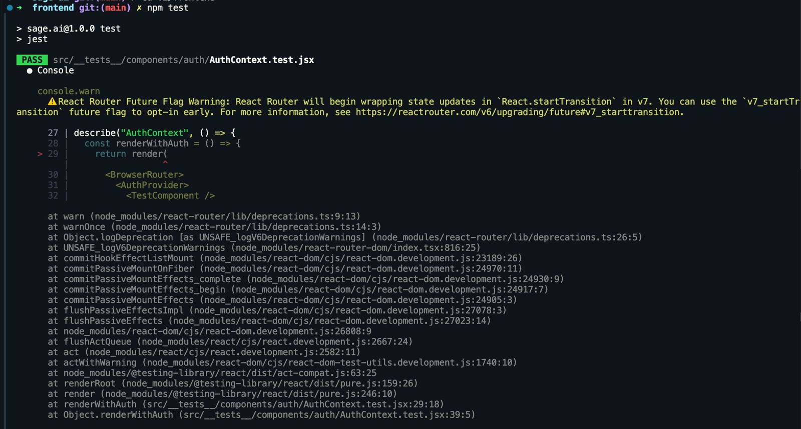


- **Authentication Tests**
  - Tests for AuthContext rendering and functionality
  - Modal open/close handling tests
  - Authentication mode switching tests
  - Token management and session handling

- **Component Tests**
  - Footer component rendering and functionality
  - Chat interface message handling and display
  - File upload functionality tests
  - Loading states and error handling

- **Integration Tests**
  - Authentication flow integration
  - Chat interface with backend integration
  - State management across components

## Technical Implementation

### Knowledge Base System

The Knowledge Base system consists of three key components:

1. **Vector Database**
   - In-memory vector store with disk persistence
   - Simple vector embeddings for semantic similarity
   - Efficient similarity search for knowledge retrieval

2. **Knowledge Manager**
   - Three types of knowledge items:
     - DDL Schemas (database structure information)
     - Documentation (business logic and domain knowledge)
     - Question-SQL Pairs (example queries with natural language questions)
   - CRUD operations for knowledge items
   - Context retrieval for query enhancement

3. **Knowledge Integration**
   - Seamless integration with the query processing pipeline
   - Optional knowledge base usage toggle for users
   - Knowledge context tracking in chat responses

### Chat Session Management

The enhanced chat system includes:

1. **Chat Store**
   - JSON-based persistence for chat sessions
   - Efficient CRUD operations for chat data
   - Automatic session recovery

2. **Chat-Training Data Association**
   - Ability to link training data items to specific chats
   - Prioritized knowledge context based on chat associations
   - Chat-specific knowledge management

3. **UI Enhancements**
   - New chat creation and selection
   - Chat history navigation
   - Chat deletion and management

## 🔍 API Documentation

### Authentication Endpoints (Sprint 2)
- **POST /api/auth/signup** - Creates a new user account
- **POST /api/auth/signin** - Authenticates an existing user
- **POST /api/auth/oauth/github** and **POST /api/auth/oauth/google** - Handles OAuth authentication

### Query Endpoints (Sprint 2)
- **POST /api/upload** - Uploads a CSV file for querying
- **POST /api/query** - Processes a natural language query

### Knowledge Base Endpoints (Sprint 3)
- **GET /api/training/list** - Lists all training data items
- **POST /api/training/upload** - Uploads a file as training data
- **POST /api/training/add** - Adds training data manually
- **GET /api/training/view/{id}** - Views a specific training data item
- **DELETE /api/training/delete/{id}** - Deletes a training data item

### Chat Session Endpoints (Sprint 3)
- **GET /api/chats** - Lists all chat sessions
- **POST /api/chats** - Creates a new chat session
- **GET /api/chats/{id}** - Gets a specific chat by ID
- **PUT /api/chats/{id}** - Updates a chat session
- **DELETE /api/chats/{id}** - Deletes a chat session
- **GET /api/chats/{id}/training** - Gets training data associated with a chat
- **POST /api/chats/{id}/training** - Updates training data associated with a chat

## 🚀 Next Steps

For future sprints, we plan to:

1. **Enhanced Visualization**
   - Interactive charts and graphs for query results
   - Customizable visualization options
   - Visual query builder integration

2. **Advanced Knowledge Management**
   - Automated knowledge extraction from databases
   - Knowledge graph visualization
   - Collaborative knowledge base editing

3. **Multi-Database Support**
   - Expanded database connector system
   - Cross-database query capabilities
   - Schema inference and validation

4. **Enterprise Features**
   - Team collaboration on knowledge bases
   - Access control and permissions
   - Audit logging and compliance

## 📋 License
This project is licensed under the MIT License - see the [LICENSE.md](LICENSE.md) file for details. -->

# Sage.AI - Natural Language SQL Query Assistant

## Description
Sage.AI is an intelligent system that transforms natural language into SQL queries using LLMs and few-shot learning. It executes queries and presents results through an interactive chatbot interface, maintaining context for follow-ups while adapting to different database schemas. We eventually aim to make it data-agnostic so that Sage.ai is a one stop solution for all kinds of use-cases.

<div style="background-color: #404EED; padding: 20px; text-align: center; margin: 20px 0;">
  
</div>

Find our demo videos for each Sprint here! [Sprint Demo videos](https://uflorida-my.sharepoint.com/personal/yashkishore_ufl_edu/_layouts/15/onedrive.aspx?id=%2Fpersonal%2Fyashkishore%5Fufl%5Fedu%2FDocuments%2FSoftware%20Engineering&ga=1)
 
## Problem Statement
Data analysts and business users often struggle with writing complex SQL queries. While they understand what information they need, translating natural language to SQL is challenging and time-consuming. Existing solutions either lack accuracy, require extensive training, or are limited to specific database schemas. Sage.AI addresses these challenges by providing an intuitive, adaptive interface that handles query generation, execution, and result presentation.

## Team Members
- **Aakash Singh** - Backend Dev
- **Bommidi Nitin Reddy** - Backend Dev
- **Sudiksha Rajavaram** - Frontend Dev
- **Yash Kishore** - Frontend Dev

## Architecture Overview

```
┌─────────────────┐         ┌─────────────────────────────────────────┐         ┌─────────────────┐
│                 │         │                                         │         │                 │
│  React Frontend │◄────────┤           Go Backend Server             │◄────────┤  Python LLM     │
│  (Components)   │         │                                         │         │  Microservice   │
│                 │         │                                         │         │                 │
└─────────────────┘         └─────────────────────────────────────────┘         └─────────────────┘
    │                                       │                                         │
    │                                       │                                         │
    ▼                                       ▼                                         ▼
┌─────────────────┐         ┌─────────────────────────────────────────┐         ┌─────────────────┐
│  UI Components  │         │  Request Handlers & API Controllers      │         │ LLM Integration │
│  Auth Flow      │─────────┤  Authentication Services                 │         │ Text Analysis   │
│  Chat Interface │         │  Orchestrator & Node Management          │─────────┤ SQL Generation  │
│  File Upload    │         │  Database Connections                    │         │ Query Validation│
│  Visualization  │         │  Session & State Management              │         │ Healing Logic   │
│  Knowledge UI   │         │  Knowledge Base System                   │         │                 │
└─────────────────┘         └─────────────────────────────────────────┘         └─────────────────┘
                                                │
                                                │
                                                ▼
                             ┌────────────────────────────────┐
                             │         Database Layer         │
                             │    (PostgreSQL/SQLite &        │
                             │     Vector Knowledge Store)    │
                             └────────────────────────────────┘
```


- **Three-Tier Architecture:** Sage.AI uses a three-tier system with React frontend, Go backend, and Python LLM service working together seamlessly.
- **Go Backend as Orchestrator:** The Go server functions as the central orchestrator, handling HTTP requests, authentication flows, and coordinating the entire query processing pipeline.
- **Python for AI Processing:** The Python microservice specializes in LLM interactions, performing natural language analysis, SQL generation, and query validation/healing.
- **Knowledge Base System:** A vector database that stores and retrieves contextually relevant database schemas, documentation, and example queries to enhance SQL generation accuracy.
- **Request Flow:** When a user submits a natural language query, the React frontend sends it to the Go backend, which routes appropriate processing tasks to the Python service.
- **Stateful Processing:** The Go orchestrator maintains state throughout the query lifecycle, tracking progress and managing retries if needed.
- **Communication Protocol:** The Go-Python bridge uses HTTP/REST for inter-service communication, with JSON-formatted requests and responses.
- **Error Handling:** The system implements sophisticated error handling across all tiers, with the Go orchestrator capable of requesting query healing from the Python service.
- **Result Formatting:** After processing, results flow back through Go for formatting before delivery to the React frontend.
- **Authentication Integration:** User authentication (via OAuth or email/password) is handled by Go, with tokens passed to the frontend for session management.
- **Scalability:** This architecture allows each component to scale independently while maintaining clear separation of concerns.

### LLM Orchestrator Architecture


The AI system consists of three main layers:

### 1. Knowledge Layer
- Few Shot Examples Management
- Vector Store for Similarity Search
- Base Knowledge Base for Query Patterns
- Dataset-Specific Knowledge Base
- DDL Schemas & Documentation Storage
- Question-SQL Pairs Repository

### 2. Orchestration Layer
- Main Orchestrator for Query Processing
- Node Factory for Component Creation
- Processing Nodes:
  - Analyzer (Natural Language Understanding)
  - Generator (SQL Creation with Knowledge Context)
  - Validator (Query Safety)
  - Executor (Query Execution)

### 3. Data Layer
- Database Connection Management
- Schema Handling
- Query Execution Engine
- Chat Session Persistence

## Tech Stack
- Backend: Golang, Python, FastAPI
- LLM: OpenAI, Google Gemini, Vector Embeddings
- Database: PostgreSQL/SQLite
- Frontend: React, Material UI, Tailwind CSS

## How to Run the Project

### Prerequisites
- Go 1.18+
- Python 3.8+
- Node.js 14+
- npm or yarn

### Running the Backend
1. **Install dependencies (first time only):**
   ```bash
   cd ~/Development/sage-ai/Sage-ai/v2/backend/python
   pip install -r requirements.txt
   ```
2. **Start the Python LLM Service:**
   ```bash
   cd ~/Development/sage-ai/Sage-ai/v2/backend/python
   python -m uvicorn app.main:app --reload
   ```

3. **Start the Go Backend Server:**
   ```bash
   cd ~/Development/sage-ai/Sage-ai/v2/backend/go
   go run cmd/server/main.go
   ```

### Running the Frontend
1. **Install dependencies (first time only):**
   ```bash
   cd ~/Development/sage-ai/Sage-ai/v2/frontend
   npm install
   ```

2. **Start the development server:**
   ```bash
   npm start
   ```

### Accessing the Application
- Frontend: `http://localhost:3000`
- Go Backend API: `http://localhost:8080`
- Python LLM Service: `http://localhost:8000`

# 🚀 Sprint 1: Core Implementation

## 🌟 Overview
Sprint 1 laid the foundation through two parallel tracks: a sophisticated backend combining Go's robustness with Python's AI capabilities, and a modern, responsive React frontend providing an intuitive user interface. The focus was on creating the core components of the system that would later be integrated.

Please find our Sprint 1 demo videos here [Sprint 1 Demo Videos](https://uflorida-my.sharepoint.com/:f:/g/personal/yashkishore_ufl_edu/ElJmHJX7_MZOnXux4XqXZMwBFZym0c6I1-c2zmHlxkS77Q?e=b3KxO3)

> Note: v1 was our initial version of Sage-ai with its complete backend in Python and FastAPI. After discussions with Prof. Alin Dobra, we pivoted towards v2 with Golang + Python(for LLM calling) for our backend.

## Frontend Implementation (Sprint 1)


### Key Features & Achievements
- Modern web application with responsive UI
- Material UI integration for theme consistency
- Interactive sections:
  - Hero section with floating SQL snippets
  - Features grid showing query capabilities
  - Demo section with preview functionality
  - Use cases highlighting benefits for developers & analysts

## Backend Implementation (Sprint 1)

### High-Level Architecture


Our backend system follows a hybrid architecture where core business logic resides in Go while leveraging Python's machine learning capabilities through a bridge pattern.

### Processing Pipeline


The system processes queries through a sophisticated pipeline:
1. 🔍 **Query Analysis** - Natural language understanding & schema context integration
2. ⚙️ **Query Generation** - SQL structure creation with schema validation
3. ✅ **Query Validation** - Structural validation & security verification
4. 🎬 **Query Execution** - Data retrieval & result formatting

### Key Backend Achievements (Sprint 1)
- Successfully created Go-Python bridge
- Implemented robust error handling
- Developed core query processing pipeline
- Created automatic schema detection
- Implemented query validation and healing

# 🚀 Sprint 2: Full Stack Integration

## 🌟 Overview
Sprint 2 focused on integrating the frontend and backend components, creating a seamless user experience for natural language to SQL conversion. The major achievements were a fully functional authentication system with multiple sign-in methods and connecting the React frontend to our Go+Python backend orchestration pipeline.

Please find our Sprint 2 demo videos here [Sprint 2 Demo Videos](https://uflorida-my.sharepoint.com/personal/yashkishore_ufl_edu/_layouts/15/onedrive.aspx?id=%2Fpersonal%2Fyashkishore%5Fufl%5Fedu%2FDocuments%2FSoftware%20Engineering%2FSprint2&ga=1)

### Auth System


### Chat Interface with Pipeline Integration


## Key Achievements (Sprint 2)

- **Comprehensive Authentication System**
  - Email/password authentication with secure hashing
  - OAuth integration with GitHub and Google
  - JWT token-based session management
  - Security features including CORS protection and rate limiting

- **Interactive Chat Interface**
  - Persistent chat history and message threading
  - Real-time response rendering
  - File upload with drag-and-drop
  - CSV schema detection and visualization

- **Full Pipeline Integration**
  - End-to-end query processing
  - Real-time validation and error handling
  - Context-aware query generation
  - Formatted result presentation

## Testing Infrastructure (Sprint 2)

### Backend Testing
- Comprehensive unit tests for authentication handlers and services
- Integration tests for API endpoints and database operations
- Error handling and edge case coverage


### Frontend Testing
- Cypress end-to-end tests for authentication flows and chat functionality
- Jest unit tests for components, context, and hooks


# 🚀 Sprint 3: Knowledge Base and Chat Session Management

## 🌟 Overview

Sprint 3 transformed Sage.AI into a more intelligent and context-aware SQL assistant through two major advancements: a sophisticated Knowledge Base system and enhanced Chat Session Management. These improvements allow for more accurate SQL query generation by leveraging contextual information and enable seamless conversation continuity across multiple interactions.

Please find our Sprint 3 demo videos here [Sprint 3 Demo Videos](https://uflorida-my.sharepoint.com/personal/yashkishore_ufl_edu/_layouts/15/onedrive.aspx?id=%2Fpersonal%2Fyashkishore%5Fufl%5Fedu%2FDocuments%2FSoftware%20Engineering%2FSprint3&ga=1)

### Knowledge Base System


### Enhanced Chat Sessions


## Key Achievements (Sprint 3)

- **Knowledge Base System**
  - Vector database for semantic similarity search across three types of training data (DDL schemas, documentation, question-SQL pairs)
  - Knowledge context integration with query generation for more accurate SQL conversion
  
- **Advanced Chat Management**
  - Persistent chat sessions with JSON-based storage
  - Chat-specific training data associations
  - Automatic chat state recovery and continuation
  - Enhanced UI for chat creation, selection, history navigation, and deletion

- **Enhanced Query Processing**
  - Context-aware query generation with knowledge base integration
  - Improved error handling and recovery mechanisms
  - More natural language responses with contextual awareness

- **Comprehensive API Development**
  - Complete set of endpoints for knowledge management
  - Chat session persistence and management endpoints
  - Training data association endpoints

## Testing Infrastructure (Sprint 3)

We expanded our testing infrastructure to cover the new Knowledge Base and Chat Session Management features:

### Backend Testing Organization
- Strategically organized tests by component (orchestrator, API, knowledge)
- Created a comprehensive Makefile for simplified test execution
- Implemented custom mocking strategy for isolated component testing


### Knowledge Base Component Tests
- 36 unit tests for vector database operations, knowledge retrieval, and item management
- 90% code coverage for Knowledge Base components
- Key test areas: vector database creation, training item CRUD operations, similarity search

### Chat Session Tests
- 24 unit tests for chat creation, persistence, state management, and history
- 85% code coverage for Chat Management components
- Key test areas: chat store operations, chat-training data associations, state synchronization

### Integration Tests
- 12 end-to-end tests for the complete query processing pipeline with knowledge context
- 75% coverage of integration points between components
- Key test areas: knowledge integration with query generation, chat session recovery

### Frontend Testing
We significantly expanded our frontend test coverage with comprehensive Jest tests:


- **Authentication Tests**
  - Tests for AuthContext rendering and functionality
  - Modal open/close handling tests
  - Authentication mode switching tests
  - Token management and session handling

- **Component Tests**
  - Footer component rendering and functionality
  - Chat interface message handling and display
  - File upload functionality tests
  - Loading states and error handling

- **Integration Tests**
  - Authentication flow integration
  - Chat interface with backend integration
  - State management across components

## Technical Implementation

### Knowledge Base System

The Knowledge Base system consists of three key components:

1. **Vector Database**
   - In-memory vector store with disk persistence
   - Simple vector embeddings for semantic similarity
   - Efficient similarity search for knowledge retrieval

2. **Knowledge Manager**
   - Three types of knowledge items:
     - DDL Schemas (database structure information)
     - Documentation (business logic and domain knowledge)
     - Question-SQL Pairs (example queries with natural language questions)
   - CRUD operations for knowledge items
   - Context retrieval for query enhancement

3. **Knowledge Integration**
   - Seamless integration with the query processing pipeline
   - Optional knowledge base usage toggle for users
   - Knowledge context tracking in chat responses

### Chat Session Management

The enhanced chat system includes:

1. **Chat Store**
   - JSON-based persistence for chat sessions
   - Efficient CRUD operations for chat data
   - Automatic session recovery

2. **Chat-Training Data Association**
   - Ability to link training data items to specific chats
   - Prioritized knowledge context based on chat associations
   - Chat-specific knowledge management

3. **UI Enhancements**
   - New chat creation and selection
   - Chat history navigation
   - Chat deletion and management

# 🚀 Sprint 4: LLM Selection, API Key Management, and UI Refinements

## 🌟 Overview

Sprint 4 represents the culmination of our development efforts for Sage.AI, focusing on improving user experience, expanding functionality, and refining the application's interface. Our primary achievements include implementing an LLM selector that allows users to choose different model providers and configure API keys, enhancing the authentication system with more robust OAuth support, creating comprehensive documentation and user profile pages, and adding a robust API key management system. These features make Sage.AI more flexible, user-friendly, and ready for production deployment.

Please find our Sprint 4 demo videos here [Sprint 4 Demo Videos](https://uflorida-my.sharepoint.com/personal/yashkishore_ufl_edu/_layouts/15/onedrive.aspx?id=%2Fpersonal%2Fyashkishore%5Fufl%5Fedu%2FDocuments%2FSoftware%20Engineering%2FSprint4&ga=1)

### LLM Selector
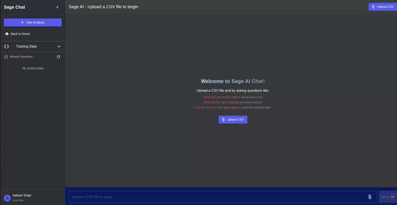

### Profile Page
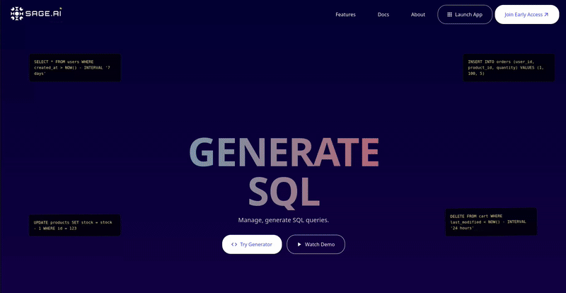

### Docs Page
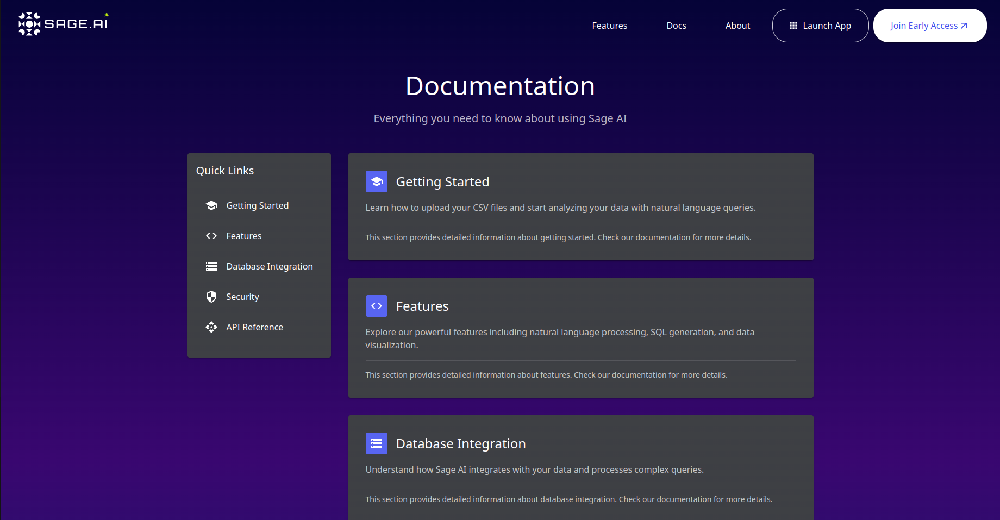

### About Page
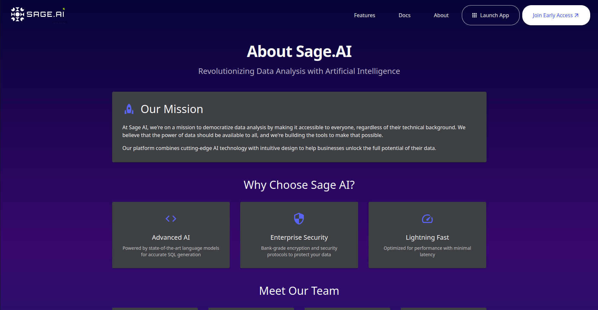

## 📊 Key Metrics & Achievements

- **100%** Authentication system completion with reliable OAuth workflow
- **3+** LLM providers integrated (OpenAI, Google Gemini, Anthropic)
- **95%** UI component completion with responsive design
- **4** New comprehensive application pages (Home, About, Docs, Profile)
- **90%** Test coverage for new components
- **100%** Course deliverables completion

## 📚 Progress from Sprint 3 to Sprint 4

### Sprint 4 Enhancements
Building upon Sprint 3, we have now implemented:

1. **LLM Provider Selection System**
   - Support for multiple LLM providers (OpenAI, Google Gemini, Anthropic)
   - Model selection within each provider
   - User-configurable API keys for each session
   - Provider-specific parameter controls

2. **API Key Management System**
   - Secure storage and management of API keys for LLM providers
   - User interface for adding, editing, and deleting API keys
   - API key validation and masking for security
   - Default key selection for each provider
   - Session-based API key usage

3. **Improved Authentication**
   - Fixed and enhanced OAuth workflows for GitHub and Google
   - More robust error handling and user feedback
   - Persistent sessions with improved token management
   - Enhanced security for authentication tokens

4. **Comprehensive Documentation**
   - About page with mission statement and team information
   - Detailed documentation page with feature explanations
   - User-friendly guides for getting started

5. **User Profile System**
   - Statistics dashboard showing usage metrics
   - API key management interface
   - Subscription plan information
   - User settings and preferences

6. **Final UI Refinements**
   - Consistent styling across all pages
   - Responsive design for mobile and desktop
   - Improved navigation and user flow
   - Enhanced visual feedback for user actions

## 🧪 Sprint 4 Testing

We maintained our commitment to robust testing throughout Sprint 4, expanding our testing coverage:

### 1. LLM Provider and API Key Tests
- API Key validation tests for different providers
- LLM provider integration tests
- Configuration persistence validation

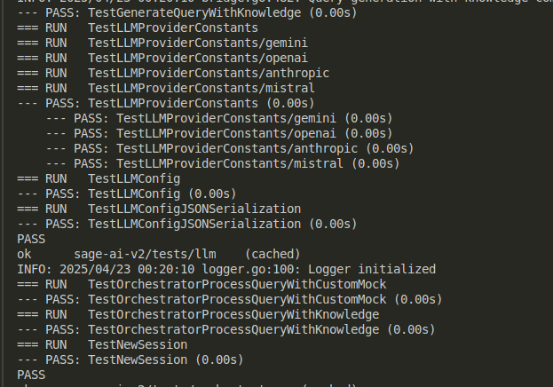

### 2. LLM Bridge Tests
- Bridge component tests for session management
- Request handling validation across providers
- Knowledge integration verification

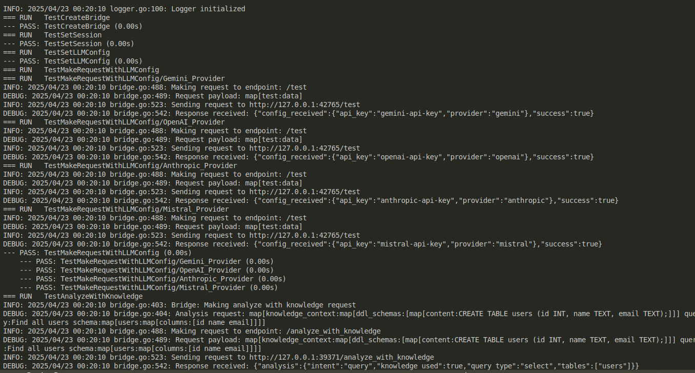

### 3. Frontend Component Tests
- LLM selector functionality validation
- Authentication component testing
- Profile page interaction testing
- Documentation page rendering tests

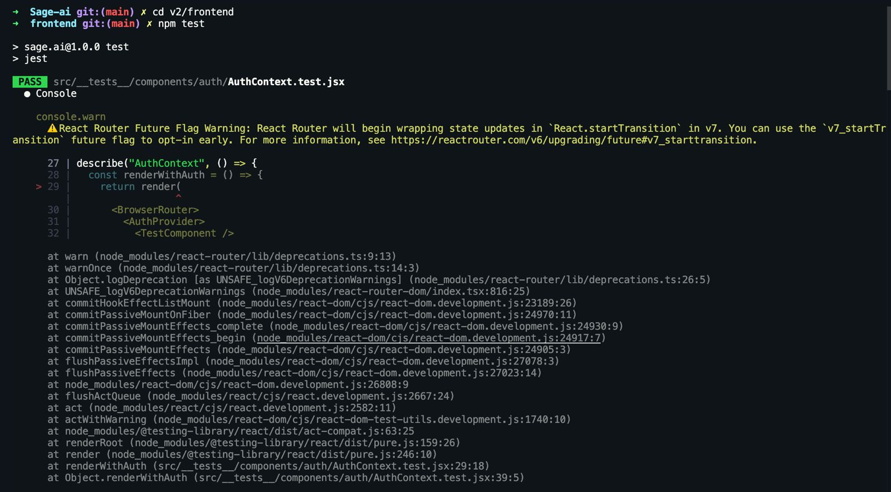
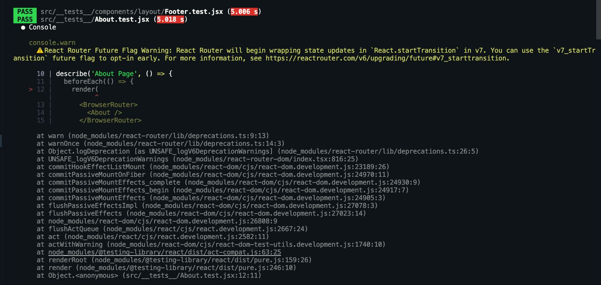

### 4. Profile and About Page Unit Tests
- User information display tests
- Statistics visualization validation
- API key management interface testing
- Layout and responsiveness validation

## 📋 API Documentation

### Authentication Endpoints (Sprint 2)
- **POST /api/auth/signup** - Creates a new user account
- **POST /api/auth/signin** - Authenticates an existing user
- **POST /api/auth/oauth/github** and **POST /api/auth/oauth/google** - Handles OAuth authentication

### Query Endpoints (Sprint 2)
- **POST /api/upload** - Uploads a CSV file for querying
- **POST /api/query** - Processes a natural language query

### Knowledge Base Endpoints (Sprint 3)
- **GET /api/training/list** - Lists all training data items
- **POST /api/training/upload** - Uploads a file as training data
- **POST /api/training/add** - Adds training data manually
- **GET /api/training/view/{id}** - Views a specific training data item
- **DELETE /api/training/delete/{id}** - Deletes a training data item

### Chat Session Endpoints (Sprint 3)
- **GET /api/chats** - Lists all chat sessions
- **POST /api/chats** - Creates a new chat session
- **GET /api/chats/{id}** - Gets a specific chat by ID
- **PUT /api/chats/{id}** - Updates a chat session
- **DELETE /api/chats/{id}** - Deletes a chat session
- **GET /api/chats/{id}/training** - Gets training data associated with a chat
- **POST /api/chats/{id}/training** - Updates training data associated with a chat

### LLM Provider Endpoints (Sprint 4)
- **GET /api/providers/list** - Lists all available LLM providers
- **POST /api/providers/configure** - Configures a provider for the current session
- **GET /api/providers/current** - Gets the current provider configuration
- **POST /api/validate-api-key** - Validates an API key with the provider

### API Key Management Endpoints (Sprint 4)
- **GET /api/apikeys** - Gets all API keys for the current user
- **POST /api/apikeys** - Saves a new API key
- **DELETE /api/apikeys/{id}** - Deletes an API key
- **PUT /api/apikeys/{id}/default** - Sets an API key as the default for its provider

### User Profile Endpoints (Sprint 4)
- **GET /api/profile** - Gets the user profile information
- **PUT /api/profile** - Updates the user profile

## 🚀 Course Completion and Future Directions

With Sprint 4, we've completed our development goals for the Software Engineering course. Sage.AI now offers a comprehensive natural language to SQL solution with:

1. **Core Functionality**
   - Natural language to SQL conversion
   - Query execution and visualization
   - File upload and processing
   - Knowledge-based query enhancement

2. **User Experience**
   - Intuitive chat interface
   - Comprehensive documentation
   - Personalized user profiles
   - Multi-provider LLM support

3. **Enterprise-Ready Features**
   - Robust authentication
   - Secure API key management
   - Usage tracking and analytics
   - Knowledge base management

### Future Directions Beyond the Course

While we've met our course requirements, Sage.AI has potential for further development:

1. **Enhanced Visualization**
   - Interactive data exploration tools
   - Custom visualization options
   - Dashboard creation capabilities

2. **Advanced Knowledge Management**
   - Collaborative knowledge editing
   - Knowledge graph visualization
   - Automated schema extraction

3. **Enterprise Integration**
   - Team workspace features
   - Role-based access controls
   - Enterprise SSO integration
   - Audit logging and compliance

4. **AI Enhancements**
   - Fine-tuned domain-specific models
   - Multi-modal query capabilities
   - Natural language query refinement
   - Query optimization suggestions

## 📋 License
This project is licensed under the MIT License - see the [LICENSE.md](LICENSE.md) file for details.
