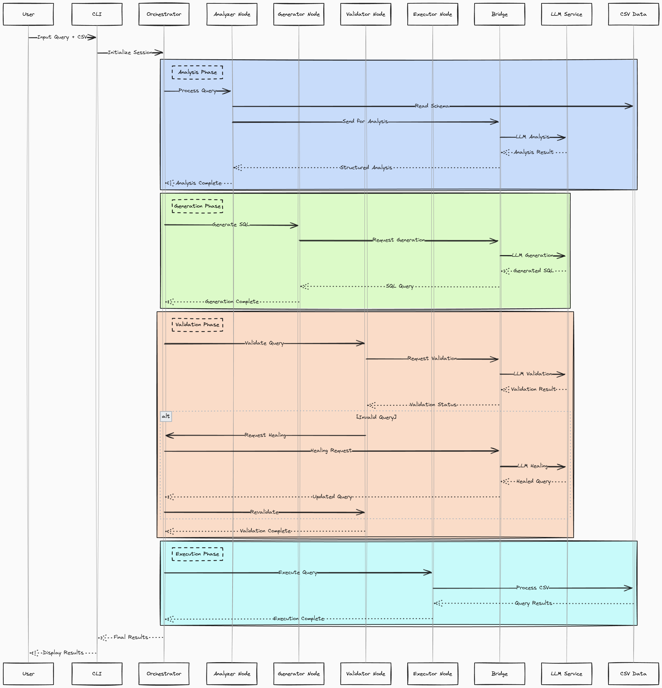

# 🚀 Sprint 1: Core Implementation of Sage-AI v2

## 🌟 Overview
Sage-AI is a natural language to SQL query conversion tool with dynamic output generation and interactivity, designed to make database querying accessible to users without deep SQL knowledge. Its unique plug-and-play architecture can dynamically integrate various data sources (APIs, hyperlinks, files, etc.) along with their schemas, making it highly versatile. 
Sprint 1 has laid the foundation through two parallel tracks: a sophisticated backend combining Go's robustness with Python's AI capabilities, featuring natural language processing, query generation, and healing mechanisms; and a modern, responsive React frontend providing an intuitive user interface with real-time query execution feedback. While these components are currently developed independently, they establish the groundwork for a powerful, user-friendly query system.

Please find our Frontend and Backend demo videos here [Sprint 1 Demo Videos](https://uflorida-my.sharepoint.com/:f:/g/personal/yashkishore_ufl_edu/ElJmHJX7_MZOnXux4XqXZMwBFZym0c6I1-c2zmHlxkS77Q?e=b3KxO3)

## Frontend Implementation

### 📚 User Stories
1. 🖥️ **User-Friendly Web Interface**  
   *"As a user, I want an intuitive web interface to enter natural language queries and see SQL results."*  
   - Built using React and Material UI for a modern UX
   - Implemented aesthetic theming with dark mode support

2. ⚡ **Real-Time Query Execution**  
   *"As a data analyst, I want to see my SQL query results immediately without delays."*  
   - Integrated live query execution using backend APIs
   - Implemented error handling and feedback messages

3. 🎨 **Feature-Rich Dashboard**  
   *"As a power user, I want a feature-rich UI to analyze SQL outputs with better visuals."*  
   - Developed responsive UI components for structured data visualization
   - Created interactive cards for Features, Demo, and Supported Platforms

4. 📱 **Mobile Responsiveness**  
   *"As a mobile user, I want to generate SQL queries from my phone without UI issues."*  
   - Implemented flexible layout adjustments for different screen sizes

### ✅ Frontend Achievements
1. 🌐 **Modern Web Application**
   - Successfully designed a fully responsive UI
   - Integrated Material UI for theme consistency
   - Created animated sections for better UX

2. 🔥 **Interactive Features**
   - Built sections including:
     - Hero Section with floating SQL snippets
     - Features Grid showing query capabilities
     - Demo Section with preview functionality
     - Use Cases highlighting developer & analyst benefits

### 🚧 Frontend Challenges
1. 🎨 **UI Enhancements**
   - Planned more dynamic UI interactions but deprioritized for core functionality
   - Mobile UI optimizations need further improvements

2. 🎭 **Framework Transition**
   - Initially built layouts using Tailwind CSS
   - Switched to Material UI for prebuilt components and consistency
   - Required rewriting existing components
   - Learning curve with Material UI's styled components & system props

## Backend Implementation

### 🏗️ Architecture and Components

### High-Level Architecture

Our backend system follows a hybrid architecture where the core business logic resides in Go while leveraging Python's machine learning capabilities through a bridge pattern. The system comprises three main layers:

1. 🛠️ Core Processing Layer (Go)
   - Handles request processing
   - Manages business logic
   - Coordinates between components
   - Ensures data consistency

2. 🧠 LLM Integration Layer (Python)
   - Processes natural language
   - Generates SQL queries
   - Validates query structure
   - Provides healing capabilities

3. 🎭 Orchestration Layer (Go)
   - Manages processing flow
   - Handles state transitions
   - Coordinates healing attempts
   - Ensures data integrity

### Low-Level Component Interaction

The system processes queries through a sophisticated pipeline:

1. 🔍 Query Analysis
   - Natural language understanding
   - Schema context integration
   - Intent identification
   - Column mapping

2. ⚙️ Query Generation
   - SQL structure creation
   - Schema validation
   - Type checking
   - Syntax verification

3. ✅ Query Validation
   - Structural validation
   - Semantic checking
   - Performance analysis
   - Security verification

4. 🎬 Query Execution
   - Data retrieval
   - Result formatting
   - Error handling
   - Response generation

### 📚 Backend User Stories
1. 💬 **Natural Language Query Processing**
   "As a data analyst, I want to query my CSV data using natural language so that I don't need to write complex SQL queries manually."
   - Created an intuitive CLI interface
   - Successfully processes natural language queries
   - Generates accurate SQL queries

2. 📊 **Schema Understanding**
   "As a user, I want the system to understand my CSV structure automatically."
   - Implemented automatic schema detection
   - Correctly identifies column types
   - Provides context-aware query generation

3. 🔧 **Query Validation and Healing**
   "As a developer, I want the system to validate and fix queries automatically."
   - Implemented multi-stage validation
   - Identifies and corrects query issues
   - Ensures query reliability

4. 📂 **Multi-Dataset Support**
   "As a data scientist, I want to use the system with different datasets."
   - Implemented dynamic schema handling
   - Works with various CSV formats
   - Provides dataset flexibility

### ✅ Backend Achievements
1. 🏗️ **Core Architecture Implementation**
   - Successfully created Go-Python bridge
   - Implemented robust error handling
   - Developed state management
   - Created logging system

2. ⚙️ **Query Processing Pipeline**
   - Implemented analysis node
   - Created generation capabilities
   - Added validation system
   - Developed execution handling

### 🚧 Backend Challenges
1. 🔧 **Technical Challenges**
   - Learning Go's concurrency model
   - Understanding Go's type system
   - Implementing proper error handling
   - Managing memory efficiently

2. 🔄 **Integration Complexities**
   - Creating effective bridge pattern
   - Handling cross-language communication
   - Managing state across services
   - Ensuring type safety

3. 📚 **Knowledge Base Implementation**
   - Vector database integration postponed
   - Historical query learning delayed
   - Context enhancement pending
   - Continuous learning features deferred

## 📝 Contributors
- Backend + LLM: Aakash Singh
- Backend + LLM: Nitin Reddy
- Frontend: Yash Kishore
- Frontend: Sudiksha Rajavaram

## 📋 License
This project is licensed under the MIT License - see the [LICENSE.md](LICENSE.md) file for details.
