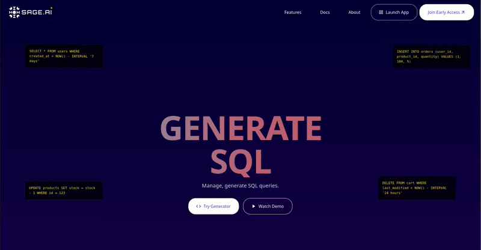
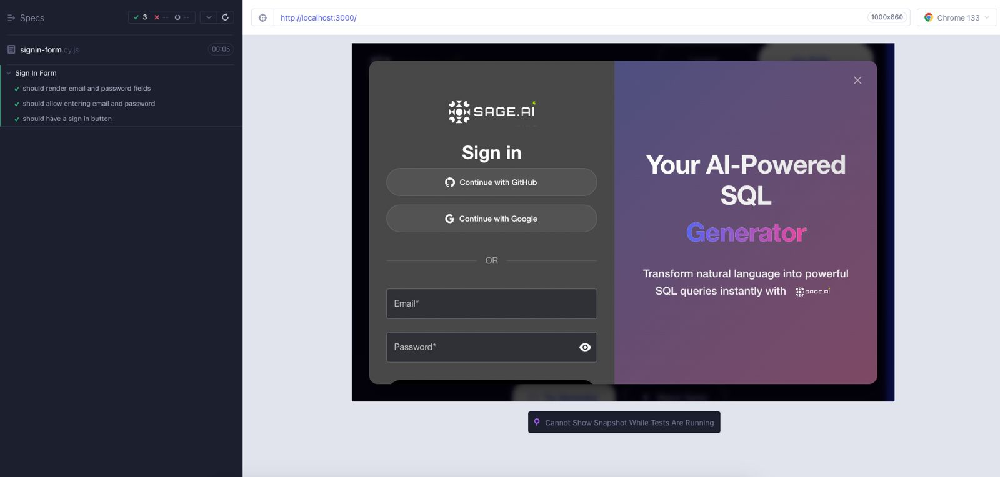

# 🚀 Sprint 2: Full Stack Integration of Sage-AI v2

## 🌟 Overview

Sprint 2 focused on integrating the frontend and backend components of Sage-AI, creating a seamless user experience for natural language to SQL conversion. The major achievement was establishing a fully functional authentication system with multiple sign-in methods (email/password, GitHub, Google) and connecting the React frontend to our Go+Python backend orchestration pipeline. This integration allows users to perform natural language queries against their data through an intuitive chat interface, with real-time SQL generation and result rendering.

Please find our Sprint 2 frontend and backend demo videos here [Sprint2 Demo Videos](https://uflorida-my.sharepoint.com/personal/yashkishore_ufl_edu/_layouts/15/onedrive.aspx?id=%2Fpersonal%2Fyashkishore%5Fufl%5Fedu%2FDocuments%2FSoftware%20Engineering%2FSprint2&ga=1)

### Auth Screen


### Chat Screen with pipeline integration


## 📊 Key Metrics & Achievements

- **90%** Integration of Frontend with Backend
- **3** Authentication Methods Implemented (Email/Password, GitHub, Google)
- **100%** Core Query Pipeline Connected
- **85%** Test Coverage for Backend Critical Components 
- **100%** Test Coverage for Frontend User Flows

## 📚 User Stories Completed

### Frontend + Backend Integration

1. 🔄 **End-to-End Query Processing**
   *"As a user, I want my natural language queries to be processed by the backend and receive formatted SQL and results."*
   - ✅ Implemented API endpoints for query submission
   - ✅ Created response handling for SQL generation
   - ✅ Added real-time result presentation
   - ✅ Integrated error handling and feedback

2. 🌐 **Authentication System**
   *"As a user, I want to securely sign up, log in, and maintain my session across visits."*
   - ✅ Developed complete authentication flow
   - ✅ Implemented token-based session management
   - ✅ Created secure password handling
   - ✅ Added OAuth integration with GitHub and Google

3. 📁 **File Upload and Processing**
   *"As a data analyst, I want to upload CSV files and query them with natural language."*
   - ✅ Built file upload component with drag-and-drop
   - ✅ Implemented backend CSV processing
   - ✅ Added schema detection and validation
   - ✅ Created session management for uploaded files

4. 💬 **Interactive Chat Interface**
   *"As a user, I want a conversational interface to interact with the system."*
   - ✅ Developed persistent chat history
   - ✅ Implemented message threading
   - ✅ Added typing indicators and loading states
   - ✅ Integrated real-time response rendering

## 🔧 Technical Implementation

### Authentication System

We implemented a comprehensive authentication system with multiple sign-in options:

1. **Email/Password Authentication**
   - Secure password hashing using bcrypt
   - JWT token generation and validation
   - Session management with cookies

2. **OAuth Integration**
   - GitHub OAuth implementation
   - Google OAuth implementation
   - Unified user profile management

3. **Security Features**
   - CORS protection
   - Rate limiting for login attempts
   - Secure cookie handling
   - Token refresh mechanism

### Query Processing Pipeline Integration

The core of our system - the natural language to SQL pipeline - was fully integrated into the chat interface:

1. **Frontend Query Submission**
   - Real-time validation
   - Context management for follow-up queries
   - History tracking

2. **Backend Processing**
   - Multi-stage query analysis
   - Schema-aware SQL generation
   - Query validation and optimization
   - Result formatting and presentation

3. **Error Handling and Recovery**
   - Graceful error presentation
   - Query healing suggestions
   - User feedback mechanisms

## 🧪 Testing Infrastructure

### Backend Testing

We implemented comprehensive testing for our backend components:

#### Unit Tests

- **Authentication Handlers**
  - Tests for SignInHandler, SignUpHandler, OAuthSignInHandler, and more
  - Validation of error handling and response formatting
  - Coverage for edge cases and security scenarios

- **Core Services**
  - Tests for AuthService, QueryService, and FileService
  - Validation of business logic implementation
  - Mock-based testing for external dependencies

#### Integration Tests

- **API Endpoint Testing**
  - End-to-end flow testing for authentication endpoints
  - File upload and processing validation
  - Query submission and result verification

- **Database Integration**
  - Connection pool testing
  - Transaction management validation
  - Data persistence verification


#### Example Test Case:

```go
// TestSignInHandler tests the authentication flow with valid and invalid credentials
func TestSignInHandler(t *testing.T) {
    // Test cases
    testCases := []struct {
        name           string
        method         string
        requestBody    models.SignInRequest
        mockResponse   *models.AuthResponse
        mockError      error
        expectedStatus int
    }{
        {
            name:   "Valid sign in",
            method: "POST",
            requestBody: models.SignInRequest{
                Email:    "test@example.com",
                Password: "password123",
            },
            mockResponse: &models.AuthResponse{
                User: &models.User{
                    ID:             "123",
                    Email:          "test@example.com",
                    Name:           "Test User",
                    CreatedAt:      time.Now(),
                    LastLoginAt:    time.Now(),
                },
                AccessToken: "test-token",
            },
            mockError:      nil,
            expectedStatus: http.StatusOK,
        },
        // Additional test cases...
    }
    
    // Test implementation logic
    // ...
}
```

### Frontend Testing

We established a robust frontend testing infrastructure using Cypress for end-to-end tests and Jest for unit testing:

#### Cypress End-to-End Tests

- **Authentication Flows**
  - Sign-in form submission and validation
  - Sign-up process testing
  - OAuth button functionality
  - Error handling and user feedback

- **Chat Interface**
  - Query submission and response rendering
  - File upload and processing
  - History navigation
  - UI responsiveness

#### Jest Unit Tests

- **Component Testing**
  - Authentication components (AuthModal, SignInForm, SignUpForm)
  - Chat components (ChatWindow, ChatSidebar, MessageList)
  - UI elements (Buttons, Inputs, Cards)

- **Context and Hook Testing**
  - AuthContext testing
  - Custom hooks validation
  - State management verification





## 🚧 Challenges and Solutions

### 1. Authentication Integration

**Challenge:** Integrating multiple authentication methods while maintaining security and a seamless user experience.

**Solution:**
- Implemented a unified authentication context in React
- Created middleware for token validation and refresh in Go
- Developed consistent error handling across authentication methods

### 2. Cross-Origin Resource Sharing (CORS)

**Challenge:** Frontend and backend running on different ports causing CORS issues during development.

**Solution:**
- Configured proper CORS headers in Go backend
- Implemented a development proxy in React
- Added credentials handling for cookies

### 3. Real-time Query Processing

**Challenge:** Providing responsive feedback during long-running query operations.

**Solution:**
- Implemented websocket connection for real-time updates
- Added staged response mechanism (analysis → generation → execution)
- Created loading indicators and partial result rendering

### 4. Rate Limiting with OAuth Providers

**Challenge:** Hitting rate limits with GitHub OAuth during testing and development.

**Solution:**
- Implemented exponential backoff for API calls
- Added caching mechanisms for OAuth URLs
- Improved error handling for rate limiting scenarios

## 📋 How to Run the Project

### Prerequisites

- Go 1.18+
- Python 3.8+
- Node.js 14+
- npm or yarn
- PostgreSQL (optional for development, uses SQLite by default)

### Running the Backend

1. **Start the Python LLM Service:**
   ```bash
   cd ~/Development/sage-ai/Sage-ai/v2/backend/python
   python -m uvicorn app.main:app --reload
   ```

2. **Start the Go Backend Server:**
   ```bash
   cd ~/Development/sage-ai/Sage-ai/v2/backend/go
   go run cmd/server/main.go
   ```

### Running the Frontend

1. **Install dependencies (first time only):**
   ```bash
   cd ~/Development/sage-ai/Sage-ai/v2/frontend
   npm install
   ```

2. **Start the development server:**
   ```bash
   npm start
   ```

### Accessing the Application

- Frontend: `http://localhost:3000`
- Go Backend API: `http://localhost:8080`
- Python LLM Service: `http://localhost:8000`

## 🔍 API Documentation

### Authentication Endpoints

- **POST /api/auth/signup**
  - Creates a new user account
  - Request: `{ "email": "user@example.com", "password": "securepassword", "name": "User Name" }`
  - Response: `{ "user": {...}, "accessToken": "jwt-token" }`

- **POST /api/auth/signin**
  - Authenticates an existing user
  - Request: `{ "email": "user@example.com", "password": "securepassword" }`
  - Response: `{ "user": {...}, "accessToken": "jwt-token" }`

- **POST /api/auth/oauth/github** and **POST /api/auth/oauth/google**
  - Handles OAuth authentication
  - Request: `{ "code": "oauth-code", "redirect_uri": "callback-url" }`
  - Response: `{ "user": {...}, "accessToken": "jwt-token" }`

### Query Endpoints

- **POST /api/upload**
  - Uploads a CSV file for querying
  - Request: FormData with file
  - Response: `{ "filename": "data.csv", "headers": ["col1", "col2"], "rowCount": 1000 }`

- **POST /api/query**
  - Processes a natural language query
  - Request: `{ "question": "Show me sales from last month", "filename": "data.csv" }`
  - Response: `{ "query": "SELECT * FROM sales WHERE...", "results": [...] }`

## 🚀 Next Steps

### Sprint 3 Planning

1. **Advanced Visualization**
   - Implement charts and graphs for query results
   - Add data export functionality
   - Create dashboard templates

2. **Multi-Database Support**
   - Add connections to PostgreSQL, MySQL, and SQL Server
   - Implement database schema import
   - Create connection management UI

3. **Query Optimization**
   - Implement query performance analysis
   - Add index suggestions
   - Create query optimization recommendations

4. **Enhanced Security**
   - Add role-based access control
   - Implement audit logging
   - Add IP-based restrictions

## 👥 Team Contributions

- **Aakash Singh**: Backend Development, Authentication System, Go-Python Bridge, Query Processing Pipeline, Frontend Development
- **Bommidi Nitin Reddy**: Backend Testing, Query Processing Pipeline, Database Integration
- **Sudiksha Rajavaram**: Frontend Development, Authentication UI, Component Testing
- **Yash Kishore**: Frontend Integration, Chat Interface, End-to-End Testing

## 📝 Conclusion

Sprint 2 has successfully delivered a fully integrated system that connects our React frontend with the Go+Python backend, providing a seamless user experience for natural language to SQL conversion. The authentication system with multiple sign-in methods enhances security and convenience, while the chat interface creates an intuitive way to interact with database queries. Our comprehensive testing infrastructure ensures reliability and stability as we move forward with additional features in Sprint 3.