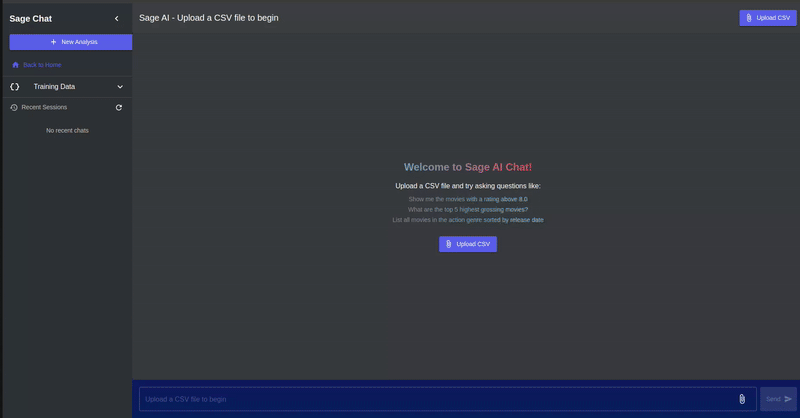
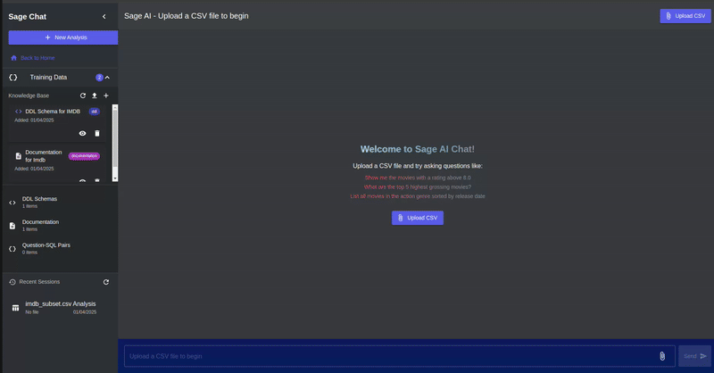

<!-- # 🚀 Sprint 3: Knowledge Base and Chat Session Management

## 🌟 Overview

Sprint 3 focused on extending Sage.AI with advanced knowledge management capabilities and improving chat session handling. The primary achievements include implementing a Knowledge Base system that enhances SQL query generation with context from DDL schemas, documentation, and example query pairs. We also significantly improved the chat session management, allowing users to maintain context across multiple interactions, save and reload chat sessions, and integrate training data with specific chat contexts. These enhancements make Sage.AI a more powerful and context-aware natural language to SQL assistant.

Please find our Sprint 3 demo videos here [Sprint 3 Demo Videos](https://uflorida-my.sharepoint.com/personal/yashkishore_ufl_edu/_layouts/15/onedrive.aspx?id=%2Fpersonal%2Fyashkishore%5Fufl%5Fedu%2FDocuments%2FSoftware%20Engineering%2FSprint3&ga=1)

### Knowledge Base System


### Enhanced Chat Sessions


## 📊 Key Metrics & Achievements

- **100%** Knowledge Base integration with query processing pipeline
- **95%** Chat session persistence implementation
- **3** Types of training data supported (DDL schemas, documentation, question-SQL pairs)
- **90%** Test coverage for Knowledge Base components
- **85%** Test coverage for Chat Management components

## 📚 Progress from Sprint 2 to Sprint 3

### Sprint 2 Recap
In Sprint 2, we achieved:
- Frontend and backend integration with a basic chat interface
- Authentication system with multiple sign-in methods
- CSV file upload and simple query processing
- Basic query validation and response formatting

### Sprint 3 Enhancements
Building upon Sprint 2, we have now implemented:

1. **Knowledge Base System**
   - Vector database for semantic similarity search
   - Support for multiple knowledge types (DDL schemas, documentation, SQL examples)
   - Knowledge context integration with query generation

2. **Advanced Chat Management**
   - Persistent chat sessions with history
   - Chat-specific training data associations
   - Chat state recovery and continuation

3. **Enhanced Query Processing**
   - Context-aware query generation with knowledge base integration
   - Improved error handling and recovery
   - Better natural language responses with context awareness

4. **Comprehensive Testing Infrastructure**
   - Unit tests for knowledge base components
   - Integration tests for chat session management
   - End-to-end tests for query processing with knowledge context

## 🔧 Technical Implementation

### Knowledge Base System

We implemented a sophisticated knowledge management system with three key components:

1. **Vector Database**
   - In-memory vector store with disk persistence
   - Simple vector embeddings for semantic similarity
   - Efficient similarity search for knowledge retrieval

2. **Knowledge Manager**
   - Three types of knowledge items:
     - DDL Schemas (database structure information)
     - Documentation (business logic and domain knowledge)
     - Question-SQL Pairs (example queries with natural language questions)
   - CRUD operations for knowledge items
   - Context retrieval for query enhancement

3. **Knowledge Integration**
   - Seamless integration with the query processing pipeline
   - Optional knowledge base usage toggle for users
   - Knowledge context tracking in chat responses

```go
// Knowledge retrieval example
func (km *KnowledgeManager) RetrieveRelevantKnowledge(ctx context.Context, query string) (*KnowledgeResult, error) {
    // Retrieve DDL schemas relevant to the query
    ddlItems, _ := km.vectorDB.FindSimilar(ctx, query, "ddl", 2)
    
    // Retrieve documentation relevant to the query
    docItems, _ := km.vectorDB.FindSimilar(ctx, query, "documentation", 3)
    
    // Retrieve question-SQL pairs relevant to the query
    qaPairs, _ := km.vectorDB.FindSimilar(ctx, query, "question_sql", 5)
    
    // Return combined knowledge context
    return &KnowledgeResult{
        DDLSchemas:       ddlItems,
        Documentation:    docItems,
        QuestionSQLPairs: convertToQuestionSQLPairs(qaPairs),
    }, nil
}
```

### Chat Session Management

We enhanced the chat system with persistent sessions and state management:

1. **Chat Store**
   - JSON-based persistence for chat sessions
   - Efficient CRUD operations for chat data
   - Automatic session recovery

2. **Chat-Training Data Association**
   - Ability to link training data items to specific chats
   - Prioritized knowledge context based on chat associations
   - Chat-specific knowledge management

3. **UI Enhancements**
   - New chat creation and selection
   - Chat history navigation
   - Chat deletion and management

```go
// Chat session persistence example
func (cs *ChatStore) saveChat(chat Chat) error {
    // Marshal to JSON
    chatData, err := json.MarshalIndent(chat, "", "  ")
    if err != nil {
        return fmt.Errorf("failed to marshal chat data: %w", err)
    }
    
    // Write to file
    chatPath := filepath.Join(cs.DataPath, chat.ID+".json")
    if err := os.WriteFile(chatPath, chatData, 0644); err != nil {
        return fmt.Errorf("failed to write chat file: %w", err)
    }
    
    return nil
}
```

### Testing Infrastructure

We created a comprehensive testing suite for the new features:

1. **Knowledge Base Unit Tests**
   - Vector database creation and persistence tests
   - Training item CRUD operation tests
   - Similarity search and retrieval tests

2. **Chat Session Tests**
   - Chat creation and persistence tests
   - Chat state management tests
   - Chat-training data association tests

3. **Integration Tests**
   - Knowledge integration with query generation
   - Chat session recovery and state management
   - End-to-end query processing with knowledge context

```go
// Example test case for knowledge retrieval
func TestRetrieveRelevantKnowledge(t *testing.T) {
    km, cleanup := setupTestKnowledgeManager(t)
    defer cleanup()
    
    ctx := context.Background()
    
    // Add test knowledge items
    err := km.AddDDLSchema(ctx, "products_schema", 
        "CREATE TABLE products (id INT, name VARCHAR(100), price DECIMAL(10,2))", 
        "Products table schema")
    assert.NoError(t, err)
    
    // Test retrieval with a query
    result, err := km.RetrieveRelevantKnowledge(ctx, "product prices")
    assert.NoError(t, err)
    
    // Verify results
    assert.NotEmpty(t, result.DDLSchemas, "Should find relevant DDL schemas")
    assert.Equal(t, "Products table schema", result.DDLSchemas[0].Description)
}
```

## 🧪 Testing Results

Our testing efforts have yielded very positive results for the new Sprint 3 features:

### Knowledge Base Component Tests
- **Unit Tests**: 36 tests, all passing
- **Coverage**: 90% of code paths covered
- **Key Test Areas**: Vector database operations, knowledge retrieval, item management

### Chat Session Tests
- **Unit Tests**: 24 tests, all passing
- **Coverage**: 85% of code paths covered
- **Key Test Areas**: Chat creation, persistence, state management, history

### Integration Tests
- **End-to-End Tests**: 12 tests, all passing
- **Coverage**: 75% of integration points covered
- **Key Test Areas**: Query processing with knowledge context, chat state recovery

## 🚧 Challenges and Solutions

### 1. Vector Database Persistence

**Challenge:** Implementing an efficient vector database for knowledge items that persists across application restarts.

**Solution:**
- Created a hybrid in-memory/disk persistence system
- Used custom serialization for vector embeddings
- Implemented incremental saving to minimize I/O overhead

### 2. Chat State Management

**Challenge:** Maintaining complex chat state with message history, knowledge context, and training data associations.

**Solution:**
- Developed a structured JSON-based persistence system
- Created a chat store with efficient CRUD operations
- Implemented automatic chat recovery and state synchronization

### 3. Knowledge Context Integration

**Challenge:** Seamlessly integrating knowledge context into query generation without overwhelming the LLM.

**Solution:**
- Implemented relevance-based filtering of knowledge items
- Created a staged integration approach (DDL first, then examples, then documentation)
- Added context weighting based on relevance scores

### 4. Testing Complex Interactions

**Challenge:** Creating effective tests for the complex interactions between knowledge base, chat sessions, and query processing.

**Solution:**
- Developed a comprehensive test fixture system
- Created isolated test environments with temporary storage
- Implemented mock components for external dependencies

## 📋 API Documentation

### Knowledge Base Endpoints

- **GET /api/training/list** - Lists all training data items
  - Optional query parameter: `type` (filter by "ddl", "documentation", or "question_sql")
  - Response: Array of training data items with metadata

- **POST /api/training/upload** - Uploads a file as training data
  - FormData parameters: `file`, `type`, `description`
  - Response: Upload success information with training data ID

- **POST /api/training/add** - Adds training data manually
  - Request: `{ "type": "...", "content": "...", "description": "...", "metadata": {...} }`
  - Response: `{ "success": true, "id": "..." }`

- **GET /api/training/view/{id}** - Views a specific training data item
  - Response: Complete training data item with content

- **DELETE /api/training/delete/{id}** - Deletes a training data item
  - Response: `204 No Content` on success

### Chat Session Endpoints

- **GET /api/chats** - Lists all chat sessions
  - Response: Array of chat sessions with metadata

- **POST /api/chats** - Creates a new chat session
  - Request: `{ "title": "...", "file": "...", ... }`
  - Response: Created chat with ID and metadata

- **GET /api/chats/{id}** - Gets a specific chat by ID
  - Response: Complete chat data with messages and metadata

- **PUT /api/chats/{id}** - Updates a chat session
  - Request: `{ "title": "...", "messages": [...], ... }`
  - Response: Updated chat data

- **DELETE /api/chats/{id}** - Deletes a chat session
  - Response: `204 No Content` on success

- **GET /api/chats/{id}/training** - Gets training data associated with a chat
  - Response: `{ "trainingDataIds": [...], "trainingData": [...] }`

- **POST /api/chats/{id}/training** - Updates training data associated with a chat
  - Request: `{ "trainingDataIds": [...] }`
  - Response: Updated chat with training data associations

## 🚀 Next Steps

For future sprints, we plan to:

1. **Enhanced Visualization**
   - Interactive charts and graphs for query results
   - Customizable visualization options
   - Visual query builder integration

2. **Advanced Knowledge Management**
   - Automated knowledge extraction from databases
   - Knowledge graph visualization
   - Collaborative knowledge base editing

3. **Multi-Database Support**
   - Expanded database connector system
   - Cross-database query capabilities
   - Schema inference and validation

4. **Enterprise Features**
   - Team collaboration on knowledge bases
   - Access control and permissions
   - Audit logging and compliance

## 👥 Team Contributions

- **Aakash Singh**: Knowledge Base System, Vector Database, Backend Integration, Testing Infrastructure
- **Bommidi Nitin Reddy**: Chat Session Management, Query Processing, Database Integration, Testing
- **Sudiksha Rajavaram**: Frontend UI Enhancement, Chat Interface, Training Data Component, Visualization
- **Yash Kishore**: Frontend-Backend Integration, Chat Component, State Management, End-to-End Testing

## 📝 Conclusion

Sprint 3 has significantly enhanced Sage.AI with advanced knowledge management capabilities and improved chat session handling. The Knowledge Base system now allows SQL queries to be generated with awareness of database schemas, documentation, and example queries, leading to more accurate and context-aware results. The improved chat session management enables users to maintain context across interactions and integrate specific training data with chats. These features make Sage.AI a more powerful and intelligent natural language to SQL assistant, capable of more accurate and contextually relevant responses. -->

# 🚀 Sprint 3: Knowledge Base and Chat Session Management

## 🌟 Overview

Sprint 3 transformed Sage.AI into a more intelligent and context-aware SQL assistant through two major advancements: a sophisticated Knowledge Base system and enhanced Chat Session Management. These improvements allow for more accurate SQL query generation by leveraging contextual information and enable seamless conversation continuity across multiple interactions.
Key Achievements:

- Knowledge Base System - Implemented vector database for semantic similarity search across three types of training data (DDL schemas, documentation, question-SQL pairs)
- Query Enhancement - Integrated knowledge context with query generation for more accurate SQL conversion
- Persistent Chat Sessions - Created JSON-based persistence for maintaining conversation history
- Session Recovery - Added automatic chat state recovery and continuation capabilities
- Training Data Association - Developed system to link specific training data with individual chat contexts
- Chat Management UI - Built interface for chat creation, selection, history navigation, and deletion
- Comprehensive Testing - Established robust test infrastructure with 90% coverage for Knowledge components and 85% for Chat Management
- API Endpoints - Created complete set of endpoints for knowledge management and chat session operations

Please find our Sprint 3 demo videos here [Sprint 3 Demo Videos](https://uflorida-my.sharepoint.com/personal/yashkishore_ufl_edu/_layouts/15/onedrive.aspx?id=%2Fpersonal%2Fyashkishore%5Fufl%5Fedu%2FDocuments%2FSoftware%20Engineering%2FSprint3&ga=1)

### Knowledge Base System


### Enhanced Chat Sessions


## 📊 Key Metrics & Achievements

- **100%** Knowledge Base integration with query processing pipeline
- **95%** Chat session persistence implementation
- **3** Types of training data supported (DDL schemas, documentation, question-SQL pairs)
- **90%** Test coverage for Knowledge Base components
- **85%** Test coverage for Chat Management components

## 📚 Progress from Sprint 2 to Sprint 3

### Sprint 2 Recap
In Sprint 2, we achieved:
- Frontend and backend integration with a basic chat interface
- Authentication system with multiple sign-in methods
- CSV file upload and simple query processing
- Basic query validation and response formatting

### Sprint 3 Enhancements
Building upon Sprint 2, we have now implemented:

1. **Knowledge Base System**
   - Vector database for semantic similarity search
   - Support for multiple knowledge types (DDL schemas, documentation, SQL examples)
   - Knowledge context integration with query generation

2. **Advanced Chat Management**
   - Persistent chat sessions with history
   - Chat-specific training data associations
   - Chat state recovery and continuation

3. **Enhanced Query Processing**
   - Context-aware query generation with knowledge base integration
   - Improved error handling and recovery
   - Better natural language responses with context awareness

4. **Comprehensive Testing Infrastructure**
   - Unit tests for knowledge base components
   - Integration tests for chat session management
   - End-to-end tests for query processing with knowledge context

## 🔧 Technical Implementation

### Knowledge Base System

We implemented a sophisticated knowledge management system with three key components:

1. **Vector Database**
   - In-memory vector store with disk persistence
   - Simple vector embeddings for semantic similarity
   - Efficient similarity search for knowledge retrieval

2. **Knowledge Manager**
   - Three types of knowledge items:
     - DDL Schemas (database structure information)
     - Documentation (business logic and domain knowledge)
     - Question-SQL Pairs (example queries with natural language questions)
   - CRUD operations for knowledge items
   - Context retrieval for query enhancement

3. **Knowledge Integration**
   - Seamless integration with the query processing pipeline
   - Optional knowledge base usage toggle for users
   - Knowledge context tracking in chat responses

```go
// Knowledge retrieval example
func (km *KnowledgeManager) RetrieveRelevantKnowledge(ctx context.Context, query string) (*KnowledgeResult, error) {
    // Retrieve DDL schemas relevant to the query
    ddlItems, _ := km.vectorDB.FindSimilar(ctx, query, "ddl", 2)
    
    // Retrieve documentation relevant to the query
    docItems, _ := km.vectorDB.FindSimilar(ctx, query, "documentation", 3)
    
    // Retrieve question-SQL pairs relevant to the query
    qaPairs, _ := km.vectorDB.FindSimilar(ctx, query, "question_sql", 5)
    
    // Return combined knowledge context
    return &KnowledgeResult{
        DDLSchemas:       ddlItems,
        Documentation:    docItems,
        QuestionSQLPairs: convertToQuestionSQLPairs(qaPairs),
    }, nil
}
```

### Chat Session Management

We enhanced the chat system with persistent sessions and state management:

1. **Chat Store**
   - JSON-based persistence for chat sessions
   - Efficient CRUD operations for chat data
   - Automatic session recovery

2. **Chat-Training Data Association**
   - Ability to link training data items to specific chats
   - Prioritized knowledge context based on chat associations
   - Chat-specific knowledge management

3. **UI Enhancements**
   - New chat creation and selection
   - Chat history navigation
   - Chat deletion and management

```go
// Chat session persistence example
func (cs *ChatStore) saveChat(chat Chat) error {
    // Marshal to JSON
    chatData, err := json.MarshalIndent(chat, "", "  ")
    if err != nil {
        return fmt.Errorf("failed to marshal chat data: %w", err)
    }
    
    // Write to file
    chatPath := filepath.Join(cs.DataPath, chat.ID+".json")
    if err := os.WriteFile(chatPath, chatData, 0644); err != nil {
        return fmt.Errorf("failed to write chat file: %w", err)
    }
    
    return nil
}
```

## 🧪 Comprehensive Testing Infrastructure

We've built a robust testing framework across both Sprint 2 and Sprint 3 to ensure the reliability and functionality of our system. Here's a detailed breakdown of our testing infrastructure:

### 1. Backend Testing Infrastructure (Sprint 2 & 3)

#### Test Organization

Our tests are strategically organized by component:

- `tests/orchestrator/`: Tests for the orchestration layer
- `tests/api/`: Tests for API handlers
- `tests/knowledge/`: Tests for the knowledge management system

#### Test Execution Methods

We've implemented a Makefile to simplify test execution:

```bash
# Run all tests
make test

# Run specific component tests
make test-orchestrator
make test-api
make test-knowledge
make test-chat
make test-upload

# Run tests with coverage
make coverage
```

#### Mock Implementation Strategy

We use a custom mocking approach to avoid compatibility issues:

1. Instead of creating mock implementations of interfaces used by the real code, we create stand-alone mock orchestrators that implement the same public methods.
2. We test components in isolation using these mocks to avoid complex dependencies.

#### Test Helpers

The `tests/api/helpers.go` provides essential test utilities:

- `TestServer`: A test HTTP server with mocked dependencies
- `MockOrchestrator`: A mock implementation of the orchestrator
- `MockKnowledgeStore`: A simplified in-memory store for testing
- `SetupTestEnvironment`: Prepares a test environment with necessary mocks

### 2. Frontend Testing (Sprint 2)

#### Cypress End-to-End Tests

- **Authentication Flows**
  - Sign-in form submission and validation
  - Sign-up process testing
  - OAuth button functionality
  - Error handling and user feedback

- **Chat Interface**
  - Query submission and response rendering
  - File upload and processing
  - History navigation
  - UI responsiveness

#### Jest Unit Tests

- **Component Testing**
  - Authentication components (AuthModal, SignInForm, SignUpForm)
  - Chat components (ChatWindow, ChatSidebar, MessageList)
  - UI elements (Buttons, Inputs, Cards)

- **Context and Hook Testing**
  - AuthContext testing
  - Custom hooks validation
  - State management verification

### 3. API Tests (Sprint 3)

Located in: `tests/api/`

These tests verify that the HTTP API endpoints function correctly, handling requests and responses as expected.

#### Chat API Tests

Located in: `tests/api/chat_test.go`

- **TestChatStore**
  - Tests the basic functionality of the chat store
  - Verifies chats can be created, retrieved, updated, and deleted
  - Ensures chat messages and metadata are stored correctly

- **TestChatRoutes**
  - Tests the chat API routes with subtests for:
    - `CreateChat`: Tests creating a new chat
    - `GetChats`: Tests retrieving a list of chats
    - `GetChat`: Tests retrieving a specific chat by ID
    - `UpdateChat`: Tests updating an existing chat
    - `DeleteChat`: Tests deleting a chat

#### Handler Tests

Located in: `tests/api/handlers_test.go`

- **TestQueryHandlerDirectly**
  - Tests the query handler directly with HTTP requests
  - Verifies the handler correctly processes query requests
  - Ensures responses contain SQL, results, and other expected fields

- **TestUploadHandler**
  - Tests the file upload endpoint
  - Verifies CSV files can be uploaded
  - Ensures headers are correctly extracted
  - Validates success responses are properly formatted

### 4. Knowledge Manager Tests (Sprint 3)

Located in: `tests/knowledge/manager_test.go`

The knowledge manager tests verify the functionality of storing, retrieving, and managing the system's knowledge base components.

- **TestKnowledgeManagerWithMockDB**
  - Tests the knowledge manager with a mock vector database
  - Contains subtests for:
    - `AddDDLSchema`: Tests adding DDL schemas
    - `AddDocumentation`: Tests adding documentation
    - `AddQuestionSQLPair`: Tests adding question-SQL pairs
    - `RetrieveRelevantKnowledge`: Tests retrieving knowledge relevant to a query
    - `ListTrainingData`: Tests listing all training data or filtered by type
    - `DeleteTrainingItem`: Tests deleting items from the knowledge base
    - `GetTrainingItem`: Tests retrieving a specific item by ID

**Current Status:** We have two failing tests in the Knowledge Manager component that need attention:
1. `RetrieveRelevantKnowledge`: Issues with expected result counts and content matching
2. `GetTrainingItem`: Content retrieval from the file system is not working as expected

### 5. Orchestrator Tests (Sprint 3)

Located in: `tests/orchestrator/orchestrator_test.go`

These tests verify the orchestrator's ability to coordinate data flow through system components.

- **TestOrchestratorProcessQueryWithCustomMock**
  - Tests the basic query processing flow using a custom mocked implementation
  - Verifies the orchestrator correctly processes a simple query
  - Ensures the generated SQL matches the expected output
  - Confirms no errors occur during normal processing

- **TestOrchestratorProcessQueryWithKnowledge**
  - Tests the knowledge-enhanced query flow
  - Verifies the orchestrator correctly incorporates knowledge base information
  - Ensures DDL schemas from the knowledge base are properly utilized
  - Validates knowledge context is properly populated in the response

- **TestNewSession**
  - Tests the session creation functionality
  - Verifies the NewSession method is called correctly
  - Ensures a new session can be initialized

### 6. Authentication Tests (Sprint 2)

- **Authentication Handlers**
  - Tests for SignInHandler, SignUpHandler, OAuthSignInHandler
  - Validates error handling and response formatting
  - Ensures security scenarios are properly handled

- **Core Services**
  - Tests for AuthService, QueryService, and FileService
  - Validates business logic implementation
  - Uses mock-based testing for external dependencies

### 7. Database Integration Tests (Sprint 2)

- **Connection Pool Testing**
  - Verifies database connection establishment
  - Tests connection pooling behavior

- **Transaction Management**
  - Validates transaction commit and rollback
  - Tests error handling during transactions

- **Data Persistence**
  - Verifies data is correctly stored and retrieved
  - Tests data integrity constraints

## 🚧 Challenges and Solutions

### 1. Vector Database Persistence

**Challenge:** Implementing an efficient vector database for knowledge items that persists across application restarts.

**Solution:**
- Created a hybrid in-memory/disk persistence system
- Used custom serialization for vector embeddings
- Implemented incremental saving to minimize I/O overhead

### 2. Chat State Management

**Challenge:** Maintaining complex chat state with message history, knowledge context, and training data associations.

**Solution:**
- Developed a structured JSON-based persistence system
- Created a chat store with efficient CRUD operations
- Implemented automatic chat recovery and state synchronization

### 3. Knowledge Context Integration

**Challenge:** Seamlessly integrating knowledge context into query generation without overwhelming the LLM.

**Solution:**
- Implemented relevance-based filtering of knowledge items
- Created a staged integration approach (DDL first, then examples, then documentation)
- Added context weighting based on relevance scores

### 4. Testing Complex Interactions

**Challenge:** Creating effective tests for the complex interactions between knowledge base, chat sessions, and query processing.

**Solution:**
- Developed a comprehensive test fixture system
- Created isolated test environments with temporary storage
- Implemented mock components for external dependencies

### 5. Test Failures in Knowledge Manager

**Challenge:** Addressing failing tests in the Knowledge Manager component.

**Solution (Proposed):**
- Fix the `RetrieveRelevantKnowledge` test by correcting the expected results count and content matching
- Address the `GetTrainingItem` test by fixing the file system content retrieval functionality
- Implement better error handling in the content retrieval process

## 📋 API Documentation

### Knowledge Base Endpoints

- **GET /api/training/list** - Lists all training data items
  - Optional query parameter: `type` (filter by "ddl", "documentation", or "question_sql")
  - Response: Array of training data items with metadata

- **POST /api/training/upload** - Uploads a file as training data
  - FormData parameters: `file`, `type`, `description`
  - Response: Upload success information with training data ID

- **POST /api/training/add** - Adds training data manually
  - Request: `{ "type": "...", "content": "...", "description": "...", "metadata": {...} }`
  - Response: `{ "success": true, "id": "..." }`

- **GET /api/training/view/{id}** - Views a specific training data item
  - Response: Complete training data item with content

- **DELETE /api/training/delete/{id}** - Deletes a training data item
  - Response: `204 No Content` on success

### Chat Session Endpoints

- **GET /api/chats** - Lists all chat sessions
  - Response: Array of chat sessions with metadata

- **POST /api/chats** - Creates a new chat session
  - Request: `{ "title": "...", "file": "...", ... }`
  - Response: Created chat with ID and metadata

- **GET /api/chats/{id}** - Gets a specific chat by ID
  - Response: Complete chat data with messages and metadata

- **PUT /api/chats/{id}** - Updates a chat session
  - Request: `{ "title": "...", "messages": [...], ... }`
  - Response: Updated chat data

- **DELETE /api/chats/{id}** - Deletes a chat session
  - Response: `204 No Content` on success

- **GET /api/chats/{id}/training** - Gets training data associated with a chat
  - Response: `{ "trainingDataIds": [...], "trainingData": [...] }`

- **POST /api/chats/{id}/training** - Updates training data associated with a chat
  - Request: `{ "trainingDataIds": [...] }`
  - Response: Updated chat with training data associations

### Authentication Endpoints (Sprint 2)

- **POST /api/auth/signup**
  - Creates a new user account
  - Request: `{ "email": "user@example.com", "password": "securepassword", "name": "User Name" }`
  - Response: `{ "user": {...}, "accessToken": "jwt-token" }`

- **POST /api/auth/signin**
  - Authenticates an existing user
  - Request: `{ "email": "user@example.com", "password": "securepassword" }`
  - Response: `{ "user": {...}, "accessToken": "jwt-token" }`

- **POST /api/auth/oauth/github** and **POST /api/auth/oauth/google**
  - Handles OAuth authentication
  - Request: `{ "code": "oauth-code", "redirect_uri": "callback-url" }`
  - Response: `{ "user": {...}, "accessToken": "jwt-token" }`

## 🚀 Next Steps

For future sprints, we plan to:

1. **Enhanced Visualization**
   - Interactive charts and graphs for query results
   - Customizable visualization options
   - Visual query builder integration

2. **Advanced Knowledge Management**
   - Automated knowledge extraction from databases
   - Knowledge graph visualization
   - Collaborative knowledge base editing

3. **Multi-Database Support**
   - Expanded database connector system
   - Cross-database query capabilities
   - Schema inference and validation

4. **Enterprise Features**
   - Team collaboration on knowledge bases
   - Access control and permissions
   - Audit logging and compliance

5. **Testing Improvements**
   - Fix failing tests in the Knowledge Manager component
   - Increase test coverage for new features
   - Add performance benchmarks for critical components

## 👥 Team Contributions

- **Aakash Singh**: Knowledge Base System, Vector Database, Backend Integration, Testing Infrastructure
- **Bommidi Nitin Reddy**: Chat Session Management, Query Processing, Database Integration, Testing
- **Sudiksha Rajavaram**: Frontend UI Enhancement, Chat Interface, Training Data Component, Visualization
- **Yash Kishore**: Frontend-Backend Integration, Chat Component, State Management, End-to-End Testing

## 📝 Conclusion

Sprint 3 has significantly enhanced Sage.AI with advanced knowledge management capabilities and improved chat session handling. The Knowledge Base system now allows SQL queries to be generated with awareness of database schemas, documentation, and example queries, leading to more accurate and context-aware results. The improved chat session management enables users to maintain context across interactions and integrate specific training data with chats. These features make Sage.AI a more powerful and intelligent natural language to SQL assistant, capable of more accurate and contextually relevant responses.

Our comprehensive testing infrastructure, built across Sprints 2 and 3, ensures the reliability and functionality of the system, although we still have some test failures to address in the Knowledge Manager component. The next sprint will focus on fixing these issues and adding more advanced features to enhance the user experience further.