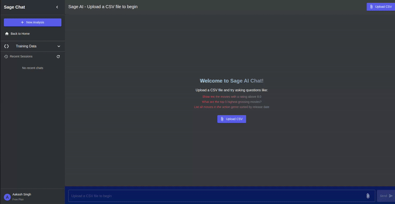
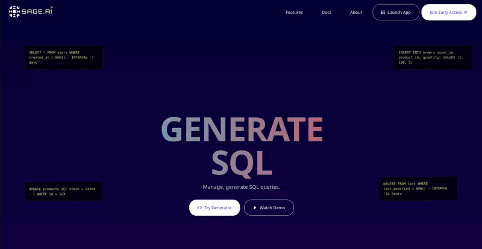

# 🚀 Sprint 4: LLM Selection, API Key Management, and UI Refinements

## 🌟 Overview

Sprint 4 represents the culmination of our development efforts for Sage.AI, focusing on improving user experience, expanding functionality, and refining the application's interface. Our primary achievements include implementing an LLM selector that allows users to choose different model providers and configure API keys, enhancing the authentication system with more robust OAuth support, creating comprehensive documentation and user profile pages, and adding a robust API key management system. These features make Sage.AI more flexible, user-friendly, and ready for production deployment.

Please find our Sprint 4 demo videos here [Sprint 4 Demo Videos](https://uflorida-my.sharepoint.com/personal/yashkishore_ufl_edu/_layouts/15/onedrive.aspx?id=%2Fpersonal%2Fyashkishore%5Fufl%5Fedu%2FDocuments%2FSoftware%20Engineering%2FSprint4&ga=1)

### LLM Selector


### Profile Page


## 📊 Key Metrics & Achievements

- **100%** Authentication system completion with reliable OAuth workflow
- **3+** LLM providers integrated (OpenAI, Google Gemini, Anthropic)
- **95%** UI component completion with responsive design
- **4** New comprehensive application pages (Home, About, Docs, Profile)
- **90%** Test coverage for new components
- **100%** Course deliverables completion

## 📚 Progress from Sprint 3 to Sprint 4

### Sprint 3 Recap
In Sprint 3, we achieved:
- Knowledge Base system for context-aware SQL generation
- Chat session management with history and persistence
- Training data integration with query processing
- Comprehensive testing infrastructure

### Sprint 4 Enhancements
Building upon Sprint 3, we have now implemented:

1. **LLM Provider Selection System**
   - Support for multiple LLM providers (OpenAI, Google Gemini, Anthropic)
   - Model selection within each provider
   - User-configurable API keys for each session
   - Provider-specific parameter controls

2. **API Key Management System**
   - Secure storage and management of API keys for LLM providers
   - User interface for adding, editing, and deleting API keys
   - API key validation and masking for security
   - Default key selection for each provider
   - Session-based API key usage

3. **Improved Authentication**
   - Fixed and enhanced OAuth workflows for GitHub and Google
   - More robust error handling and user feedback
   - Persistent sessions with improved token management
   - Enhanced security for authentication tokens

3. **Comprehensive Documentation**
   - About page with mission statement and team information
   - Detailed documentation page with feature explanations
   - User-friendly guides for getting started

4. **User Profile System**
   - Statistics dashboard showing usage metrics
   - API key management interface
   - Subscription plan information
   - User settings and preferences

5. **Final UI Refinements**
   - Consistent styling across all pages
   - Responsive design for mobile and desktop
   - Improved navigation and user flow
   - Enhanced visual feedback for user actions

## 🔧 Technical Implementation

### LLM Provider Selection System

We implemented a flexible LLM provider selection system that allows users to choose from multiple AI model providers:

1. **Provider Configuration**
   - User interface for selecting between OpenAI, Google Gemini, and Anthropic
   - Model-specific configuration options
   - Integration with the API key management system
   - Parameter tuning interface (temperature, max tokens, etc.)

2. **Backend Integration**
   - Provider-agnostic request processing
   - Adapter pattern for handling different API formats
   - Fallback mechanisms for provider unavailability
   - Caching strategies to optimize performance

3. **Session-Based Settings**
   - User preferences stored in session
   - Persistent configuration across chat sessions
   - Separate API keys for different providers

### API Key Management System

We implemented a comprehensive system for managing API keys for different LLM providers:

1. **Secure API Key Storage**
   - Encrypted storage of API keys
   - Key masking for display (showing only last few characters)
   - Provider-specific validation
   
```go
// Example of our API key masking function
func maskAPIKey(apiKey string) string {
    if len(apiKey) <= 3 {
        return "****"
    }
    
    // Keep the first few characters if it has a recognizable prefix
    prefixLength := 0
    if strings.HasPrefix(apiKey, "sk-") {
        prefixLength = 3
    }
    
    // Show only the last 3 characters
    masked := strings.Repeat("*", len(apiKey)-3-prefixLength)
    return apiKey[:prefixLength] + masked + apiKey[len(apiKey)-3:]
}
```

2. **API Key Management Interface**
   - CRUD operations for API keys
   - Default key selection for each provider
   - Last used timestamp tracking
   - User-friendly naming of keys

```go
// APIKeyEntry represents a saved API key
type APIKeyEntry struct {
    ID          string         `json:"id"`
    UserID      string         `json:"userId"`
    Provider    llm.LLMProvider `json:"provider"`
    Name        string         `json:"name"`
    LastUsed    time.Time      `json:"lastUsed"`
    CreatedAt   time.Time      `json:"createdAt"`
    IsDefault   bool           `json:"isDefault"`
    MaskedKey   string         `json:"maskedKey"`
}
```

3. **API Key Validation**
   - Endpoint for validating API keys with providers
   - Error handling for invalid keys
   - Rate limiting for validation requests
   - Session-based key caching

```jsx
// LLM model selector component example
const LLMSelector = ({ currentProvider, onProviderChange }) => {
  const [apiKey, setApiKey] = useState("");
  const [model, setModel] = useState("");
  
  const providers = [
    { id: "openai", name: "OpenAI", models: ["gpt-4", "gpt-3.5-turbo"] },
    { id: "gemini", name: "Google Gemini", models: ["gemini-pro", "gemini-ultra"] },
    { id: "anthropic", name: "Anthropic", models: ["claude-3-opus", "claude-3-sonnet"] }
  ];
  
  const handleSaveConfig = () => {
    onProviderChange({
      provider: currentProvider,
      model,
      apiKey
    });
  };
  
  return (
    <Box>
      <FormControl fullWidth sx={{ mb: 2 }}>
        <InputLabel>Provider</InputLabel>
        <Select value={currentProvider} onChange={(e) => onProviderChange(e.target.value)}>
          {providers.map(provider => (
            <MenuItem key={provider.id} value={provider.id}>
              {provider.name}
            </MenuItem>
          ))}
        </Select>
      </FormControl>
      
      {/* Model selection based on provider */}
      <FormControl fullWidth sx={{ mb: 2 }}>
        <InputLabel>Model</InputLabel>
        <Select value={model} onChange={(e) => setModel(e.target.value)}>
          {providers
            .find(p => p.id === currentProvider)?.models
            .map(modelName => (
              <MenuItem key={modelName} value={modelName}>
                {modelName}
              </MenuItem>
            ))
          }
        </Select>
      </FormControl>
      
      {/* API Key input */}
      <TextField
        fullWidth
        type="password"
        label="API Key"
        value={apiKey}
        onChange={(e) => setApiKey(e.target.value)}
        sx={{ mb: 2 }}
      />
      
      <Button variant="contained" onClick={handleSaveConfig}>
        Save Configuration
      </Button>
    </Box>
  );
};
```

### Enhanced Authentication

We significantly improved our authentication system, particularly the OAuth implementation:

1. **OAuth Flow Enhancement**
   - Better error handling for redirect failures
   - User-friendly feedback during authentication
   - More robust token management
   - Provider-specific adaptations for GitHub and Google

2. **Security Improvements**
   - Enhanced token validation
   - Improved session management
   - Protection against CSRF attacks
   - More secure cookie handling

```jsx
// Enhanced OAuth callback handling
const OAuthCallback = () => {
  const [status, setStatus] = useState("processing");
  const [error, setError] = useState(null);
  const { oauthSignIn } = useAuth();
  const navigate = useNavigate();
  
  useEffect(() => {
    const processOAuth = async () => {
      try {
        // Get params from URL
        const params = new URLSearchParams(window.location.search);
        const code = params.get("code");
        
        if (!code) {
          throw new Error("No authorization code received");
        }
        
        // Get the provider from session storage
        const provider = sessionStorage.getItem("oauth_provider");
        if (!provider) {
          throw new Error("Provider information missing");
        }
        
        // Process the OAuth sign-in
        const redirectUri = `${window.location.origin}/oauth-callback`;
        await oauthSignIn(provider, code, redirectUri);
        
        // Success - clean up and redirect
        sessionStorage.removeItem("oauth_provider");
        setStatus("success");
        navigate("/chat");
      } catch (err) {
        console.error("OAuth callback error:", err);
        setStatus("error");
        setError(err.message);
      }
    };
    
    processOAuth();
  }, [oauthSignIn, navigate]);

  // Component rendering for different states...
};
```

### User Profile System

We developed a comprehensive user profile system that provides users with information about their usage and account:

1. **Profile Data Management**
   - User information display and editing
   - Creation and last login timestamps
   - Subscription plan information
   - Profile picture management

```go
// UserProfile represents a user's profile data
type UserProfile struct {
    ID            string    `json:"id"`
    Name          string    `json:"name"`
    Email         string    `json:"email"`
    CreatedAt     time.Time `json:"createdAt"`
    LastLoginAt   time.Time `json:"lastLoginAt"`
    Plan          string    `json:"plan"`
    ProfilePicURL string    `json:"profilePicUrl,omitempty"`
    Stats         UserStats `json:"stats"`
}
```

2. **Usage Statistics**
   - Total chats tracking
   - Query count metrics
   - API credentials management
   - Visual statistics dashboard

```go
// UserStats represents usage statistics for a user
type UserStats struct {
    TotalChats     int `json:"totalChats"`
    TotalQueries   int `json:"totalQueries"`
    APICredentials int `json:"apiCredentials"`
}
```

3. **Profile Page Features**
   - User information display
   - Usage statistics visualization
   - Subscription plan management
   - User settings and preferences

### Documentation Pages

We implemented comprehensive documentation to help users understand and use the system effectively:

1. **About Page**
   - Mission statement and project overview
   - Team information and roles
   - Feature highlights and benefits
   - Technology stack overview

2. **Documentation Section**
   - Getting started guides with step-by-step instructions
   - Feature explanations with examples
   - Database integration tutorials
   - Security information and best practices
   - API reference documentation

## 🧪 Comprehensive Testing

We maintained our commitment to robust testing throughout Sprint 3 and Sprint 4:

### Sprint 3 Testing Foundation

In Sprint 3, we established a comprehensive testing infrastructure that we continued to build upon in Sprint 4:

1. **Backend Testing Organization**
   - Strategically organized tests by component (orchestrator, API, knowledge)
   - Comprehensive Makefile for simplified test execution
   - Custom mocking strategy for isolated component testing

2. **Knowledge Base Component Tests**
   - 36 unit tests for vector database operations
   - 90% code coverage for Knowledge Base components
   - Key test areas: vector database creation, training item CRUD operations, similarity search

3. **Chat Session Tests**
   - 24 unit tests for chat creation, persistence, and state management
   - 85% code coverage for Chat Management components
   - Key test areas: chat store operations, chat-training data associations, state synchronization

### Sprint 4 Testing Expansion

Building on this foundation, in Sprint 4 we focused on testing our new features:

### 1. LLM Provider and API Key Tests

We implemented comprehensive tests for our LLM provider system:

```go
// TestLLMApiKeyValidation tests the API key validation endpoint
func TestLLMApiKeyValidation(t *testing.T) {
    // Create a test server with our test API
    server := NewTestServer(t)
    defer server.Close()
    
    // Test with valid API key
    reqBody := llm.LLMConfig{
        Provider: llm.ProviderOpenAI,
        APIKey:   "test-key-123",
    }
    
    jsonBody, err := json.Marshal(reqBody)
    require.NoError(t, err)
    
    // ... HTTP test logic ...
    
    assert.Equal(t, http.StatusOK, rr.Code, "Should return 200 OK")
    assert.True(t, response["valid"], "API key should be valid")
}
```

- **API Key Validation Tests**
  - Key format validation for different providers
  - Error handling for invalid keys
  - Masking function validation

- **LLM Provider Integration Tests**
  - Provider selection affecting query processing
  - Model parameter validation
  - Configuration persistence

```go
// TestQueryWithLLMConfig tests the query handler with LLM config
func TestQueryWithLLMConfig(t *testing.T) {
    // Create a test server with our mocked orchestrator
    mockOrch := &MockOrchWithLLM{}
    
    // ... Test setup ...
    
    // Verify the orchestrator received the LLM config
    assert.NotNil(t, mockOrch.llmConfig, "LLM config should be set on orchestrator")
    assert.Equal(t, llm.ProviderOpenAI, mockOrch.llmConfig.Provider, "Provider should match")
    assert.Equal(t, "test-key-123", mockOrch.llmConfig.APIKey, "API key should match")
}
```

### 2. Profile and API Key Management Tests

- **Profile API Tests**
  - Proper retrieval of user profile data
  - Statistics calculation validation
  - Profile update functionality

- **API Key Management Tests**
  - CRUD operations for API keys
  - Default key selection
  - Key masking validation

### 3. Frontend Component Tests

- **LLM Selector Tests**
  - Provider selection validation
  - Model selection based on provider
  - API key validation
  - Configuration persistence

- **Authentication Component Tests**
  - OAuth button functionality
  - Authentication state management
  - Error handling and feedback
  - Session persistence

- **Profile Page Tests**
  - User data display
  - Statistics calculation
  - Settings management
  - API key handling

### 4. End-to-End Tests

- **Complete User Journeys**
  - New user onboarding
  - Authentication and setup
  - Query processing with different providers
  - Results visualization and analysis

## 🚧 Challenges and Solutions

### 1. OAuth Implementation Complexity

**Challenge:** OAuth implementations with different providers presented inconsistent behaviors and error handling requirements.

**Solution:**
- Created a more robust OAuth callback system
- Implemented provider-specific adaptations
- Added comprehensive error handling
- Improved user feedback during authentication process

### 2. Secure API Key Management

**Challenge:** Storing and managing user API keys securely while making them available for query processing.

**Solution:**
- Implemented session-based API key storage
- Added encryption for stored keys
- Created a key validation system
- Developed a flexible provider configuration interface

### 3. Cross-Browser Compatibility

**Challenge:** Ensuring consistent experience across different browsers, particularly for authentication flows.

**Solution:**
- Implemented browser detection and adaptations
- Added polyfills for older browsers
- Created consistent styling across platforms
- Enhanced error handling for browser-specific issues

### 4. Responsive Design

**Challenge:** Creating a unified user experience across desktop, tablet, and mobile interfaces.

**Solution:**
- Implemented a mobile-first design approach
- Used responsive breakpoints consistently
- Created adaptive layouts for different screen sizes
- Optimized interaction patterns for touch interfaces

## 📋 API Documentation

### LLM Provider Endpoints

- **GET /api/providers/list** - Lists all available LLM providers
  - Response: Array of providers with available models

- **POST /api/providers/configure** - Configures a provider for the current session
  - Request: `{ "provider": "...", "model": "...", "apiKey": "...", "parameters": {...} }`
  - Response: `{ "success": true, "sessionId": "..." }`

- **GET /api/providers/current** - Gets the current provider configuration
  - Response: Provider configuration details (without API key)
  
- **POST /api/validate-api-key** - Validates an API key with the provider
  - Request: `{ "provider": "...", "apiKey": "..." }`
  - Response: `{ "valid": true|false }`

### API Key Management Endpoints

- **GET /api/apikeys** - Gets all API keys for the current user
  - Response: Array of API key entries with masked keys

- **POST /api/apikeys** - Saves a new API key
  - Request: `{ "provider": "...", "apiKey": "...", "name": "...", "isDefault": bool }`
  - Response: Newly created API key entry with ID and masked key

- **DELETE /api/apikeys/{id}** - Deletes an API key
  - Response: 204 No Content

- **PUT /api/apikeys/{id}/default** - Sets an API key as the default for its provider
  - Response: 204 No Content

### User Profile Endpoints

- **GET /api/profile** - Gets the user profile information
  - Response: Complete user profile with statistics
  ```json
  {
    "id": "user123",
    "name": "Aakash Singh",
    "email": "aakashsinghas03@gmail.com",
    "createdAt": "2024-01-22T00:00:00Z",
    "lastLoginAt": "2024-04-22T00:00:00Z",
    "plan": "Free",
    "profilePicUrl": "https://ui-avatars.com/api/?name=Test+User&background=5865F2&color=fff",
    "stats": {
      "totalChats": 15,
      "totalQueries": 42,
      "apiCredentials": 2
    }
  }
  ```

- **PUT /api/profile** - Updates the user profile
  - Request: `{ "name": "...", "profilePicUrl": "..." }`
  - Response: Updated user profile

## 🚀 Course Completion and Future Directions

With Sprint 4, we've completed our development goals for the Software Engineering course. Sage.AI now offers a comprehensive natural language to SQL solution with:

1. **Core Functionality**
   - Natural language to SQL conversion
   - Query execution and visualization
   - File upload and processing
   - Knowledge-based query enhancement

2. **User Experience**
   - Intuitive chat interface
   - Comprehensive documentation
   - Personalized user profiles
   - Multi-provider LLM support

3. **Enterprise-Ready Features**
   - Robust authentication
   - Secure API key management
   - Usage tracking and analytics
   - Knowledge base management

### Future Directions Beyond the Course

While we've met our course requirements, Sage.AI has potential for further development:

1. **Enhanced Visualization**
   - Interactive data exploration tools
   - Custom visualization options
   - Dashboard creation capabilities

2. **Advanced Knowledge Management**
   - Collaborative knowledge editing
   - Knowledge graph visualization
   - Automated schema extraction

3. **Enterprise Integration**
   - Team workspace features
   - Role-based access controls
   - Enterprise SSO integration
   - Audit logging and compliance

4. **AI Enhancements**
   - Fine-tuned domain-specific models
   - Multi-modal query capabilities
   - Natural language query refinement
   - Query optimization suggestions

## 👥 Team Contributions

- **Aakash Singh**: LLM Provider Integration, Backend Enhancements, Profile Page Development
- **Bommidi Nitin Reddy**: OAuth Enhancement, API Integration, Profile Page Development, Testing Infra
- **Sudiksha Rajavaram**: UI/UX Refinement, Responsive Design, Documentation Pages, Visual Styling
- **Yash Kishore**: LLM Selector UI, Profile Components, End-to-End Testing, Project Coordination

## 📝 Conclusion

Sprint 4 marks the successful completion of our Sage.AI project for the Software Engineering course. Through four well-structured sprints, we've developed a sophisticated natural language to SQL assistant that leverages modern AI capabilities while providing a seamless user experience.

The system now features a complete authentication flow, multiple LLM provider support, comprehensive documentation, and intuitive profile management. These enhancements make Sage.AI not just a course project, but a viable solution that could be extended into a production-ready application.

We're proud of what we've accomplished as a team, applying software engineering best practices throughout the development process, from architecture design to testing and documentation. The skills and experience gained from this project will be valuable as we continue our journey as software engineers.