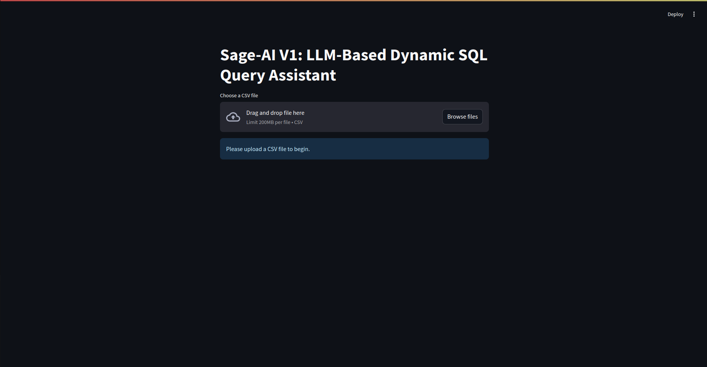
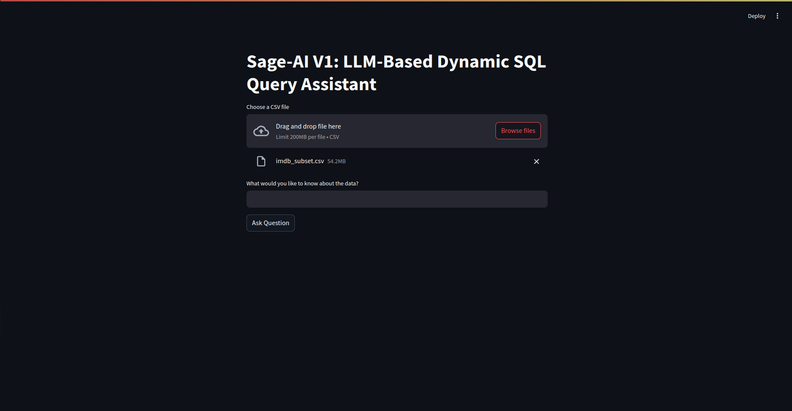
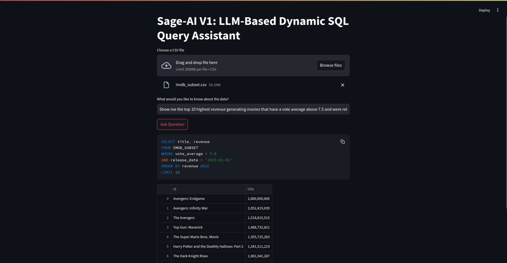

# Sage-AI Demo V1: Dynamic SQL Query Assistant


This is a demo for Sage-AI Sprint 1 which goes over the core AI-System functionalities of our project. It is a dynamic SQL query assistant that converts natural language questions into SQL queries using Google's Gemini Free API for testing purposes. This application allows users to upload any CSV file and query it using natural language.

### Streamlit app with minimalistic UI focusing on the core functionality


### Drag-and-drop/Browse any csv file from your system to investigate with Sage-AI


### LLM generates SQL query and an interactive data visualisation for your questions


## 🌟 Features

- 🔄 Dynamic CSV file handling
- 💬 Natural language to SQL conversion
- 📊 Automatic database schema generation
- 📈 Interactive data visualization
- 🤖 Powered by Google's Gemini AI (Free-tier for demo purposes)

## 🚀 Quick Start

### Prerequisites

```bash
pip install streamlit pandas python-dotenv google-generativeai
```

### Environment Setup

1. Create a `.env` file in your project root:
```
GOOGLE_API_KEY=your_actual_api_key_here
```

2. Get your Google API key from:
   - Visit [Google AI Studio](https://makersuite.google.com/app/apikey)
   - Create a new API key
   - Copy it to your `.env` file

### Running the Application

```bash
streamlit run app.py
```

## 📝 Sample Queries

For Demo purposes, we used [IMDB Movies From 1960 to 2024 dataset](https://www.kaggle.com/datasets/raedaddala/imdb-movies-from-1960-to-2023) from Kaggle. This turned out to be a great dataset to test out the core functionality of our project. Here are some complex and interesting queries we tried with the IMDB dataset for your reference:

1. "Show me the top 10 highest revenue generating movies that have a vote average above 7.5 and were released after 2015"

2. "What's the average runtime and revenue for each genre, only including genres that have more than 50 movies?"

3. "List the movies where the budget is less than 10 million but generated more than 100 million in revenue, include their ROI percentage"

4. "Which production companies have released the most movies with a vote average above 8.0? Show top 5 companies and their movie count"

5. "Find movies that have similar keywords as 'Inception', list them by vote average"

## 📁 File Structure

```
Sage-ai/validation
├── app.py             # Main Streamlit application
├── database_utils.py  # Database utility
├── .env               # Environment variables
└── README.md          # Documentation
```

## 💡 Usage Tips

1. **File Size**: For optimal performance, ensure your CSV file is under 200MB
2. **Data Types**: The application automatically detects and handles different data types
3. **Complex Queries**: The system can handle joins, aggregations, and nested queries
4. **Error Handling**: Clear error messages are provided for debugging

## 🔧 Handling Large Files

For files larger than 200MB, you can:

1. Increase Streamlit's file size limit by creating `.streamlit/config.toml`:
```toml
[server]
maxUploadSize = 400
```

2. Or use this script to create a smaller subset:
```python
import pandas as pd

# Read the original CSV
df = pd.read_csv('your_large_file.csv')

# Take first 100k rows
df_small = df.head(100000)

# Save to new CSV
df_small.to_csv('subset_file.csv', index=False)
```

## 📄 License

This project is licensed under the MIT License - see the LICENSE file for details.